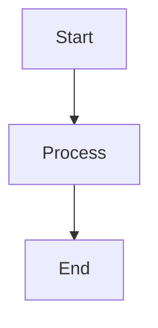

# Mermaid Diagrams Setup for GitHub Pages

## Problem

The `jekyll-mermaid` plugin is **NOT supported by GitHub Pages**. GitHub Pages only supports a limited set of whitelisted Jekyll plugins, and `jekyll-mermaid` is not one of them.

## Solution

We use a **client-side JavaScript approach** to render Mermaid diagrams. This works perfectly with GitHub Pages since it doesn't require any server-side plugins.

## How It Works

1. **JavaScript Library**: We load Mermaid.js from CDN in `_includes/head.html`
2. **Automatic Processing**: JavaScript finds code blocks with `language-mermaid` class and converts them to Mermaid diagrams
3. **Styling**: Custom CSS ensures diagrams display properly

## Usage

### In Your Posts

Use standard markdown code blocks with `mermaid` language identifier:

````markdown

````

### Layout Options

1. **Regular posts**: Use `layout: post` (default)
2. **Posts with enhanced Mermaid support**: Use `layout: mermaid-post`

### Supported Diagram Types

- Flowcharts
- Sequence diagrams
- Class diagrams
- State diagrams
- Gantt charts
- Pie charts
- Git graphs
- User journey diagrams

## Configuration

### Mermaid Settings

The Mermaid configuration is in `_includes/head.html`:

```javascript
mermaid.initialize({
  startOnLoad: true,
  theme: 'default',
  themeVariables: {
    primaryColor: '#ff6b6b',
    primaryTextColor: '#333',
    primaryBorderColor: '#ff6b6b',
    lineColor: '#333',
    secondaryColor: '#4ecdc4',
    tertiaryColor: '#ffe66d'
  }
});
```

### Customizing Themes

You can change the theme by modifying the `theme` property:
- `'default'`
- `'dark'`
- `'forest'`
- `'neutral'`

## Troubleshooting

### Diagrams Not Rendering

1. **Check syntax**: Ensure your Mermaid syntax is correct
2. **Clear cache**: Hard refresh your browser (Ctrl+F5)
3. **Check console**: Look for JavaScript errors in browser console

### Performance Issues

1. **Large diagrams**: Consider breaking complex diagrams into smaller ones
2. **Multiple diagrams**: The page might take longer to load with many diagrams

## Testing

Use the test post at `_posts/2024-07-15-mermaid-test.md` to verify everything is working correctly.

## Best Practices

1. **Keep diagrams simple**: Complex diagrams may not render well on mobile
2. **Use descriptive labels**: Make diagrams self-explanatory
3. **Test locally**: Use Jekyll serve to test before pushing to GitHub
4. **Responsive design**: Diagrams automatically scale on mobile devices

## Files Modified

- `_config.yml`: Removed unsupported plugin references
- `_includes/head.html`: Added Mermaid JavaScript and initialization
- `style.scss`: Added Mermaid-specific CSS styling
- `_layouts/mermaid-post.html`: Created enhanced layout for Mermaid posts

## Alternative Solutions

If this approach doesn't work for your needs, consider:

1. **GitHub Actions**: Use custom build process with GitHub Actions
2. **Pre-rendered images**: Convert diagrams to images before committing
3. **External hosting**: Host Jekyll site elsewhere (Netlify, Vercel, etc.)
