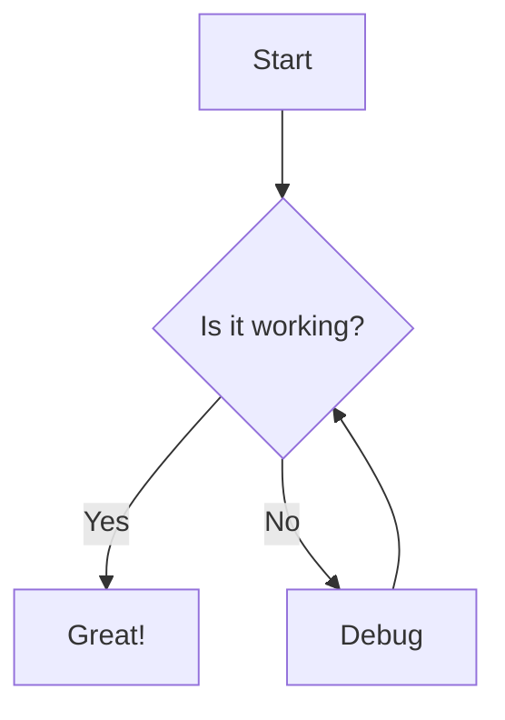
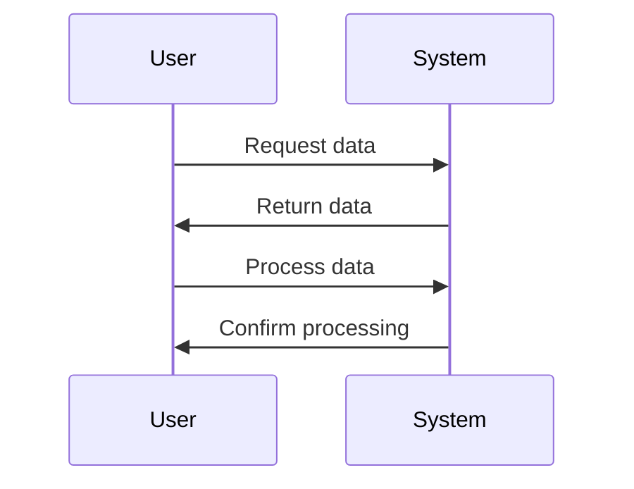
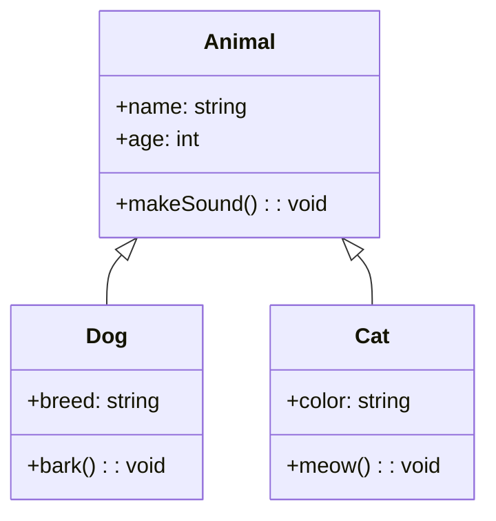
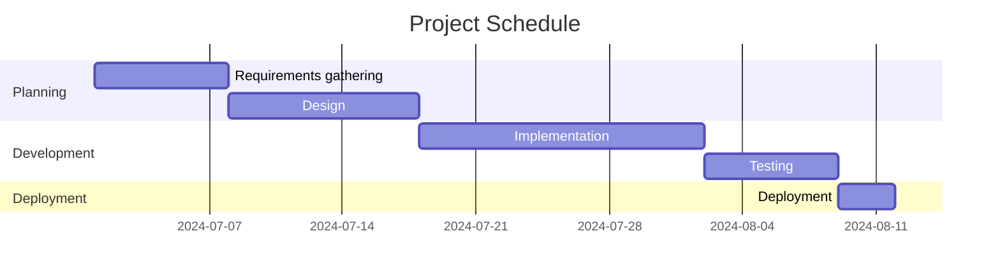

## Testing Mermaid Diagrams

This post tests the rendering of Mermaid diagrams on GitHub Pages.

### Flowchart Example

### Sequence Diagram Example

### Class Diagram Example

### Gantt Chart Example

## Conclusion

If you can see the diagrams above, then Mermaid is working correctly on your GitHub Pages site!
