## 设计模式

设计原则：单一职责原则、开放封闭原则、里氏替换原则、最少知识原则、接口隔离原则、依赖倒置原则。

### 单例模式

#### c++的单例模式，实际上是一种管理全局变量和静态函数的设计模式。

#### 1. 饿汉式单例

- 特点

  - 在类加载时就创建实例，线程安全。
  - 类一加载，单例就被实例化，浪费了内存（如果实例始终未被使用）。

- 实现步骤
  - 将构造函数声明为私有，防止外部创建实例。
  - 创建一个静态实例，并在类加载时初始化。
  - 提供一个静态方法返回实例。

#### 2. 懒汉式单例

- 特点

  - 在第一次调用获取实例时才创建实例，避免了类加载时立即初始化的问题。
  - 需要注意线程安全问题，如果多个线程同时调用，可能会创建多个实例。

- 实现步骤
  - 将构造函数声明为私有。
  - 创建一个静态实例变量，但不初始化。
  - 在 getInstance 方法中判断是否已创建实例，如果没有则创建。

#### 3. 双重检查锁

- 特点

  - 在`懒汉式`基础上增加了线程安全的优化。
  - 通过双重判断和加锁，保证实例只被创建一次，同时减少了锁的性能开销。

- 实现步骤
  - 外层判断是否为 nullptr，避免进入锁。
  - 内层加锁，并再次判断是否需要初始化。

#### 4. 静态内部类

- 特点

  - 基于 Java 的类加载机制，利用静态内部类的特点实现延迟加载。
  - 静态内部类在被调用时才会加载，并初始化单例。

- 实现步骤

  - 外部类构造函数私有。
  - 定义一个静态内部类，内部类中包含单例实例。
  - 提供一个静态方法调用内部类实例。

#### 5. 枚举

- 特点

  - 最简洁且最安全的实现方式，避免了序列化和反射问题。
  - 通过枚举的唯一性保证单例。

- 实现步骤
  - 定义一个枚举类型，其中包含单例实例。
  - 提供方法访问该实例。

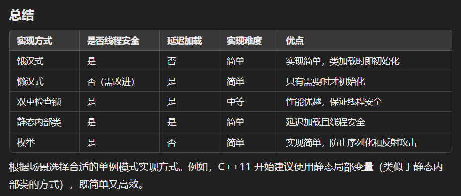

### 简单工厂模式(静态工厂模式)

#### 工厂可以根据参数的不同返回不同的产品

#### 1. 组成

- Factory(工厂)：核心部分，负责实现创建所有产品的内部逻辑，工厂类可以被外界直接调用，创建所需对象
  工厂类是整个模式的关键.包含了必要的逻辑判断,根据外界给定的信息,决定究竟应该创建哪个具体类的对象.通过使用工厂类,外界可以从直接创建具体产品对象的尴尬局面摆脱出来,仅仅需要负责“消费”对象就可以了

- Product(抽象类产品)：工厂类所创建的所有对象的父类，封装了产品对象的公共方法，所有的具体产品为其子类对象

- ProductA、ProductB…(具体产品)：简单工厂模式的创建目标，所有被创建的对象都是某个具体类的实例。它要实现抽象产品中声明的抽象方法

```c++
#include <bits/stdc++.h>

using namespace std;

// 以披萨为例，创建披萨的工厂类
// 假设有三种披萨，分别为：奶酪披萨、香肠披萨、海鲜披萨
class Pizza
{
public:
    virtual void prepare() = 0;
    virtual void bake() = 0;
    virtual void cut() = 0;
    virtual void box() = 0;
    virtual ~Pizza() {}
};

class CheesePizza : public Pizza
{
public:
    void prepare() override
    {
        cout << "Prepare cheese pizza" << endl;
    }
    void bake() override
    {
        cout << "Bake cheese pizza" << endl;
    }
    void cut() override
    {
        cout << "Cut cheese pizza" << endl;
    }
    void box() override
    {
        cout << "Box cheese pizza" << endl;
    }
};

class PepperoniPizza : public Pizza
{
public:
    void prepare() override
    {
        cout << "Prepare pepperoni pizza" << endl;
    }
    void bake() override
    {
        cout << "Bake pepperoni pizza" << endl;
    }
    void cut() override
    {
        cout << "Cut pepperoni pizza" << endl;
    }
    void box() override
    {
        cout << "Box pepperoni pizza" << endl;
    }
};

class SeafoodPizza : public Pizza
{
public:
    void prepare() override
    {
        cout << "Prepare seafood pizza" << endl;
    }
    void bake() override
    {
        cout << "Bake seafood pizza" << endl;
    }
    void cut() override
    {
        cout << "Cut seafood pizza" << endl;
    }
    void box() override
    {
        cout << "Box seafood pizza" << endl;
    }
};

class PizzaFactory
{
public:
    static Pizza *createPizza(const string &type)
    {
        if (type == "cheese")
        {
            return new CheesePizza();
        }
        else if (type == "pepperoni")
        {
            return new PepperoniPizza();
        }
        else if (type == "seafood")
        {
            return new SeafoodPizza();
        }
        else
        {
            cout << "Unknown pizza type" << endl;
            return nullptr;
        }
    }
};

int main()
{
    string pizzaType;
    cout << "Enter pizza type (cheese/pepperoni/seafood): ";
    cin >> pizzaType;

    Pizza *pizza = PizzaFactory::createPizza(pizzaType);
    if (pizza != nullptr)
    {
        pizza->prepare();
        pizza->bake();
        pizza->cut();
        pizza->box();
        delete pizza;
    }

    return 0;
}
```

#### 缺点

- 违反开放-封闭原则（OCP）： 当需要新增一种产品时，需要修改工厂类的源代码来添加新的产品类型，这违反了开放-封闭原则。每次修改都会导致工厂类的变化，可能引发其他代码的修改和重新测试，增加了维护成本和风险。

- 单一职责原则问题： 简单工厂模式中的工厂类负责创建不同类型的产品，导致工厂类的职责不够单一，违反了单一职责原则。随着产品类型的增加，工厂类的代码逐渐变得臃肿，难以维护和理解。

- 如果需要新增一种产品类型，除了要修改工厂类的代码外，还可能需要修改客户端代码来传递正确的参数类型。这种做法不够灵活，难以应对产品类型的频繁变化。

- 虽然简单工厂模式封装了对象的创建过程，但它也隐藏了产品的具体创建细节，导致客户端无法直接控制对象的创建过程，无法灵活地定制对象的创建方式。

### 工厂模式

- 工厂方法模式定义了一个创建对象的接口，但由子类决定要实例化的类是哪一个，也就是说工厂模式让实例化推迟到子类。

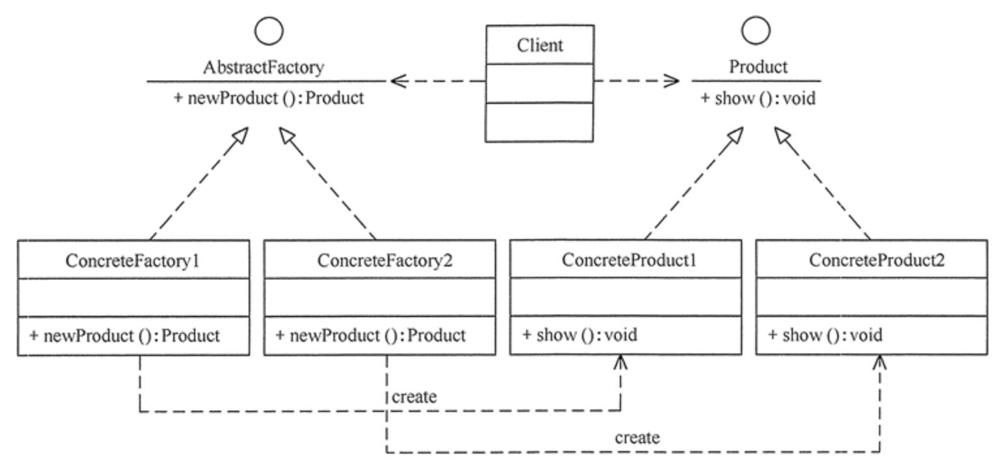

```c++
#include <bits/stdc++.h>

using namespace std;

class Pizza
{
public:
    virtual void prepare() = 0;
    virtual void bake() = 0;
    virtual void cut() = 0;
    virtual void box() = 0;
    virtual ~Pizza() {}
};

class CheesePizza : public Pizza
{
public:
    void prepare()
    {
        cout << "Preparing cheese pizza" << endl;
    }
    void bake()
    {
        cout << "Baking cheese pizza" << endl;
    }
    void cut()
    {
        cout << "Cutting cheese pizza" << endl;
    }
    void box()
    {
        cout << "Boxing cheese pizza" << endl;
    }
};

class PepperoniPizza : public Pizza
{
public:
    void prepare()
    {
        cout << "Preparing pepperoni pizza" << endl;
    }
    void bake()
    {
        cout << "Baking pepperoni pizza" << endl;
    }
    void cut()
    {
        cout << "Cutting pepperoni pizza" << endl;
    }
    void box()
    {
        cout << "Boxing pepperoni pizza" << endl;
    }
};

class SeafoodPizza : public Pizza
{
public:
    void prepare()
    {
        cout << "Preparing seafood pizza" << endl;
    }
    void bake()
    {
        cout << "Baking seafood pizza" << endl;
    }
    void cut()
    {
        cout << "Cutting seafood pizza" << endl;
    }
    void box()
    {
        cout << "Boxing seafood pizza" << endl;
    }
};

class PizzaFactory
{
public:
    virtual Pizza *createPizza() = 0;
    virtual ~PizzaFactory() {}
};

class CheesePizzaFactory : public PizzaFactory
{
public:
    Pizza *createPizza() override
    {
        return new CheesePizza();
    }
};

class PepperoniPizzaFactory : public PizzaFactory
{
public:
    Pizza *createPizza() override
    {
        return new PepperoniPizza();
    }
};

class SeafoodPizzaFactory : public PizzaFactory
{
public:
    Pizza *createPizza() override
    {
        return new SeafoodPizza();
    }
};

int main()
{
    string pizzaType;
    cout << "Enter pizza type (cheese/pepperoni/seafood): ";
    cin >> pizzaType;

    PizzaFactory *factory = nullptr;
    if (pizzaType == "cheese")
    {
        factory = new CheesePizzaFactory();
    }
    else if (pizzaType == "pepperoni")
    {
        factory = new PepperoniPizzaFactory();
    }
    else if (pizzaType == "seafood")
    {
        factory = new SeafoodPizzaFactory();
    }
    else
    {
        cout << "Unknown pizza type" << endl;
        return 1;
    }

    Pizza *pizza = factory->createPizza();
    if (pizza != nullptr)
    {
        pizza->prepare();
        pizza->bake();
        pizza->cut();
        pizza->box();
        delete pizza;
    }

    delete factory;

    return 0;
}
```

### 抽象工厂模式

抽象工厂的思想是：把有关联关系的，属于一个产品簇的所有产品创建的接口函数，放在一个抽象工厂里面 AbstractFactory，派生类（具体产品的工厂）应该负责创建该产品簇里面所有的产品。

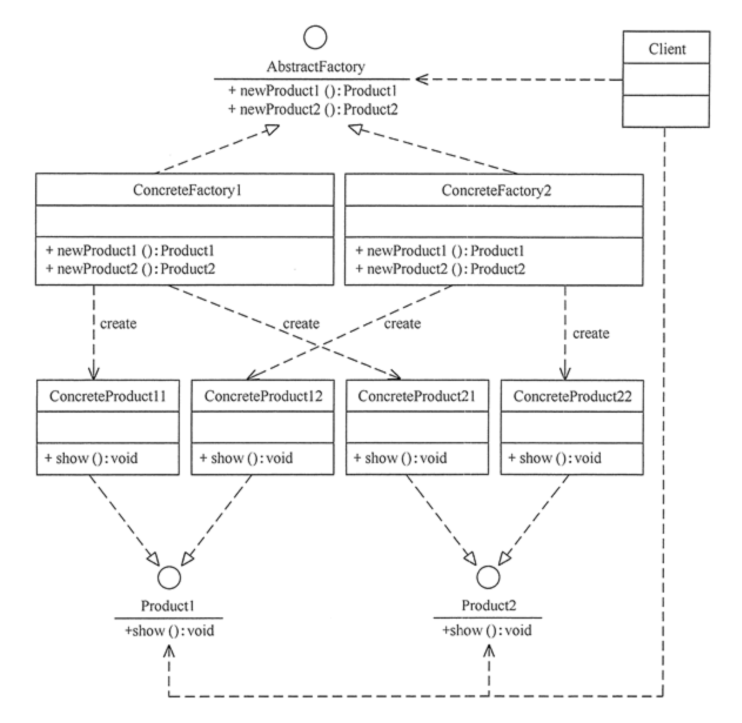

```c++
#include <bits/stdc++.h>
using namespace std;

// 披萨基类
class Pizza
{
public:
    virtual void prepare() = 0;
    virtual void bake() = 0;
    virtual void cut() = 0;
    virtual void box() = 0;
    virtual ~Pizza() {}
};

// 奶酪披萨类
class CheesePizza : public Pizza
{
public:
    void prepare() override
    {
        cout << "Preparing cheese pizza" << endl;
    }
    void bake() override
    {
        cout << "Baking cheese pizza" << endl;
    }
    void cut() override
    {
        cout << "Cutting cheese pizza" << endl;
    }
    void box() override
    {
        cout << "Boxing cheese pizza" << endl;
    }
};

// 香肠披萨类
class PepperoniPizza : public Pizza
{
public:
    void prepare() override
    {
        cout << "Preparing pepperoni pizza" << endl;
    }
    void bake() override
    {
        cout << "Baking pepperoni pizza" << endl;
    }
    void cut() override
    {
        cout << "Cutting pepperoni pizza" << endl;
    }
    void box() override
    {
        cout << "Boxing pepperoni pizza" << endl;
    }
};

// 海鲜披萨类
class SeafoodPizza : public Pizza
{
public:
    void prepare() override
    {
        cout << "Preparing seafood pizza" << endl;
    }
    void bake() override
    {
        cout << "Baking seafood pizza" << endl;
    }
    void cut() override
    {
        cout << "Cutting seafood pizza" << endl;
    }
    void box() override
    {
        cout << "Boxing seafood pizza" << endl;
    }
};

// 汉堡基类
class Hamburger
{
public:
    virtual void prepare() = 0;
    virtual void cook() = 0;
    virtual void cut() = 0;
    virtual void pack() = 0;
    virtual ~Hamburger() {}
};

// 奶酪汉堡类
class CheeseHamburger : public Hamburger
{
public:
    void prepare() override
    {
        cout << "Preparing cheese hamburger" << endl;
    }
    void cook() override
    {
        cout << "Cooking cheese hamburger" << endl;
    }
    void cut() override
    {
        cout << "Cutting cheese hamburger" << endl;
    }
    void pack() override
    {
        cout << "Packing cheese hamburger" << endl;
    }
};

// 香肠汉堡类
class PepperoniHamburger : public Hamburger
{
public:
    void prepare() override
    {
        cout << "Preparing pepperoni hamburger" << endl;
    }
    void cook() override
    {
        cout << "Cooking pepperoni hamburger" << endl;
    }
    void cut() override
    {
        cout << "Cutting pepperoni hamburger" << endl;
    }
    void pack() override
    {
        cout << "Packing pepperoni hamburger" << endl;
    }
};

// 海鲜汉堡类
class SeafoodHamburger : public Hamburger
{
public:
    void prepare() override
    {
        cout << "Preparing seafood hamburger" << endl;
    }
    void cook() override
    {
        cout << "Cooking seafood hamburger" << endl;
    }
    void cut() override
    {
        cout << "Cutting seafood hamburger" << endl;
    }
    void pack() override
    {
        cout << "Packing seafood hamburger" << endl;
    }
};

// 抽象工厂基类
class AbstractFactory
{
public:
    virtual Pizza *createPizza() = 0;
    virtual Hamburger *createHamburger() = 0;
    virtual ~AbstractFactory() {}
};

// 奶酪披萨和奶酪汉堡工厂类
class CheeseFactory : public AbstractFactory
{
public:
    Pizza *createPizza() override
    {
        return new CheesePizza();
    }

    Hamburger *createHamburger() override
    {
        return new CheeseHamburger();
    }
};

// 香肠披萨和香肠汉堡工厂类
class PepperoniFactory : public AbstractFactory
{
public:
    Pizza *createPizza() override
    {
        return new PepperoniPizza();
    }

    Hamburger *createHamburger() override
    {
        return new PepperoniHamburger();
    }
};

// 海鲜披萨和海鲜汉堡工厂类
class SeafoodFactory : public AbstractFactory
{
public:
    Pizza *createPizza() override
    {
        return new SeafoodPizza();
    }

    Hamburger *createHamburger() override
    {
        return new SeafoodHamburger();
    }
};

int main()
{
    string productType;
    cout << "Enter product type (cheese/pepperoni/seafood): ";
    cin >> productType;

    AbstractFactory *factory = nullptr;
    if (productType == "cheese")
    {
        factory = new CheeseFactory();
    }
    else if (productType == "pepperoni")
    {
        factory = new PepperoniFactory();
    }
    else if (productType == "seafood")
    {
        factory = new SeafoodFactory();
    }
    else
    {
        cout << "Unknown product type" << endl;
        return 1;
    }

    Pizza *pizza = factory->createPizza();
    if (pizza != nullptr)
    {
        pizza->prepare();
        pizza->bake();
        pizza->cut();
        pizza->box();
        delete pizza;
    }

    Hamburger *hamburger = factory->createHamburger();
    if (hamburger != nullptr)
    {
        hamburger->prepare();
        hamburger->cook();
        hamburger->cut();
        hamburger->pack();
        delete hamburger;
    }

    delete factory;

    return 0;
}
```

### 装饰器模式

装饰者模式的精髓在于动态的给对象增减功能。

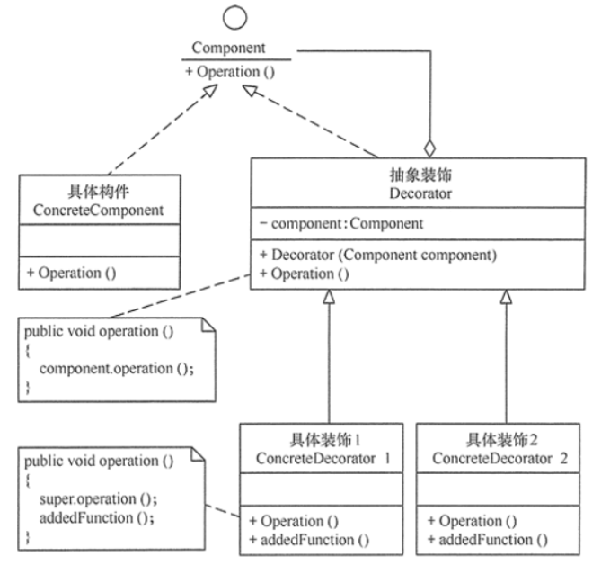

```c++
#include <bits/stdc++.h>
using namespace std;

// 抽象组件基类
class Hamburger
{
public:
    virtual string getDescription() const = 0;
    virtual double cost() const = 0;
    virtual ~Hamburger() = default;
};

// 具体组件类 - 基本汉堡
class BasicHamburger : public Hamburger
{
public:
    string getDescription() const override
    {
        return "Basic Hamburger";
    }

    double cost() const override
    {
        return 5.0; // 基本汉堡的价格
    }
};

// 抽象装饰器类
class HamburgerDecorator : public Hamburger
{
protected:
    Hamburger *m_hamburger;

public:
    HamburgerDecorator(Hamburger *hamburger) : m_hamburger(hamburger) {}

    string getDescription() const override
    {
        return m_hamburger->getDescription();
    }

    double cost() const override
    {
        return m_hamburger->cost();
    }
};

// 具体装饰器类 - 加奶酪
class CheeseDecorator : public HamburgerDecorator
{
public:
    CheeseDecorator(Hamburger *hamburger) : HamburgerDecorator(hamburger) {}

    string getDescription() const override
    {
        return m_hamburger->getDescription() + ", Cheese";
    }

    double cost() const override
    {
        return m_hamburger->cost() + 1.0; // 加奶酪的价格
    }
};

// 具体装饰器类 - 加培根
class BaconDecorator : public HamburgerDecorator
{
public:
    BaconDecorator(Hamburger *hamburger) : HamburgerDecorator(hamburger) {}

    string getDescription() const override
    {
        return m_hamburger->getDescription() + ", Bacon";
    }

    double cost() const override
    {
        return m_hamburger->cost() + 1.5; // 加培根的价格
    }
};

// 具体装饰器类 - 加蔬菜
class VegetableDecorator : public HamburgerDecorator
{
public:
    VegetableDecorator(Hamburger *hamburger) : HamburgerDecorator(hamburger) {}

    string getDescription() const override
    {
        return m_hamburger->getDescription() + ", Vegetables";
    }

    double cost() const override
    {
        return m_hamburger->cost() + 0.5; // 加蔬菜的价格
    }
};

int main()
{
    Hamburger *hamburger = new BasicHamburger();
    cout << "You ordered: " << hamburger->getDescription() << " for $" << hamburger->cost() << endl;

    // 添加奶酪
    hamburger = new CheeseDecorator(hamburger);
    cout << "You ordered: " << hamburger->getDescription() << " for $" << hamburger->cost() << endl;

    // 添加培根
    hamburger = new BaconDecorator(hamburger);
    cout << "You ordered: " << hamburger->getDescription() << " for $" << hamburger->cost() << endl;

    // 添加蔬菜
    hamburger = new VegetableDecorator(hamburger);
    cout << "You ordered: " << hamburger->getDescription() << " for $" << hamburger->cost() << endl;

    // 清理内存
    delete hamburger;

    return 0;
}

```

### 适配器模式

适配器模式可以把一个类的接口变换成客户端所期待的另一种接口，从而使原本接口不匹配而无法一起工作的两个类能够在一起工作。

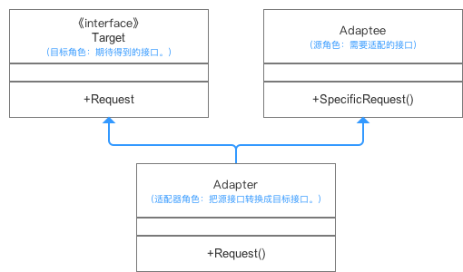

```c++
#include <iostream>
#include <string>

// 旧的系统接口
class LegacySystem
{
public:
    void specificRequest()
    {
        std::cout << "LegacySystem: Handling request." << std::endl;
    }
};

// 客户端期望的接口
class Target
{
public:
    virtual ~Target() = default;
    virtual void request() const = 0;
};

// 具体的目标实现
class ConcreteTarget : public Target
{
public:
    void request() const override
    {
        std::cout << "ConcreteTarget: Handling request." << std::endl;
    }
};

// 适配器类，将 LegacySystem 适配成 Target 接口
class Adapter : public Target
{
private:
    LegacySystem *m_legacySystem;

public:
    Adapter(LegacySystem *legacySystem) : m_legacySystem(legacySystem) {}

    void request() const override
    {
        std::cout << "Adapter: (ADAPTED) LegacySystem interface." << std::endl;
        m_legacySystem->specificRequest();
    }
};

// 客户端代码
class Client
{
public:
    void doWork(const Target *target)
    {
        target->request();
    }
};

int main()
{
    std::cout << "Client: I can work just fine with the ConcreteTarget objects:" << std::endl;
    ConcreteTarget *target = new ConcreteTarget();
    Client *client = new Client();
    client->doWork(target);
    delete target;

    std::cout << "\nClient: I can also work with the LegacySystem objects via an adapter:" << std::endl;
    LegacySystem *legacySystem = new LegacySystem();
    Target *adapter = new Adapter(legacySystem);
    client->doWork(adapter);
    delete adapter;
    delete legacySystem;

    delete client;

    return 0;
}
```

### 观察者模式

观察者模式解决的是一个对象状态改变时，如何自动通知其他依赖对象的问题，同时保持对象间的低耦合和高协作性。

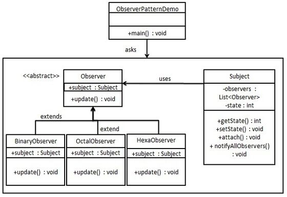

```c++
#include <bits/stdc++.h>
using namespace std;

// 抽象观察者基类
class Observer
{
public:
    virtual ~Observer() = default;
    virtual void update(const string &messageFromSubject) = 0;
};

// 主题类
class Subject
{
private:
    vector<weak_ptr<Observer>> m_observers; // 使用 weak_ptr 避免循环引用
    string m_message;

public:
    void attach(shared_ptr<Observer> observer)
    {
        m_observers.push_back(observer);
        cout << "Observer added to the Subject." << endl;
    }

    void detach(shared_ptr<Observer> observer)
    {
        m_observers.erase(remove_if(m_observers.begin(), m_observers.end(),
                                    [observer](const weak_ptr<Observer> &wp)
                                    {
                                        return wp.expired() || wp.lock() == observer;
                                    }),
                          m_observers.end());
        cout << "Observer removed from the Subject." << endl;
    }

    void notify()
    {
        for (auto &observer : m_observers)
        {
            if (auto sharedObserver = observer.lock())
            {
                sharedObserver->update(m_message);
            }
        }
    }

    void createMessage(const string &message = "Empty Message")
    {
        m_message = message;
        cout << "Message updated to: " << m_message << endl;
        notify();
    }

    string getMessage() const
    {
        return m_message;
    }
};

// 具体观察者类，同时继承 enable_shared_from_this 保证共享同一 shared_ptr
class ConcreteObserver : public Observer, public enable_shared_from_this<ConcreteObserver>
{
private:
    string m_name;
    string m_messageFromSubject;
    bool activeRemoved; // 标志是否已主动移除
public:
    ConcreteObserver(const string &name) : m_name(name), activeRemoved(false) {}

    ~ConcreteObserver()
    {
        if (!activeRemoved)
            cout << "Observer \"" << m_name << "\" removed from the Subject upon destruction." << endl;
        else
            cout << "Observer \"" << m_name << "\" destructed after active removal." << endl;
    }

    void update(const string &messageFromSubject) override
    {
        m_messageFromSubject = messageFromSubject;
        printInfo();
    }

    // 通过外部调用，将自己添加到主题中
    void attachToSubject(shared_ptr<Subject> subject)
    {
        subject->attach(shared_from_this());
        cout << "Observer \"" << m_name << "\" added to the Subject." << endl;
    }

    // 主动从主题中移除自己，并设置 activeRemoved 标志
    void removeMeFromTheList(shared_ptr<Subject> subject)
    {
        subject->detach(shared_from_this());
        activeRemoved = true;
        cout << "Observer \"" << m_name << "\" actively removed from the Subject." << endl;
    }

    void printInfo()
    {
        cout << "Observer \"" << m_name << "\": a new message is available --> " << m_messageFromSubject << endl;
    }
};

int main()
{
    auto subject = make_shared<Subject>();

    auto observer1 = make_shared<ConcreteObserver>("Observer 1");
    auto observer2 = make_shared<ConcreteObserver>("Observer 2");
    auto observer3 = make_shared<ConcreteObserver>("Observer 3");

    // 添加观察者到主题
    observer1->attachToSubject(subject);
    observer2->attachToSubject(subject);
    observer3->attachToSubject(subject);

    subject->createMessage("Hello Observers!");

    // 主动移除 observer3
    observer3->removeMeFromTheList(subject);

    subject->createMessage("Observer 3 removed.");

    return 0;
}

```

### 外观模式

外观模式为一个复杂的子系统提供一个一致的高层接口。这样，客户端代码就可以通过这个简化的接口与子系统交互，而不需要了解子系统内部的复杂性。

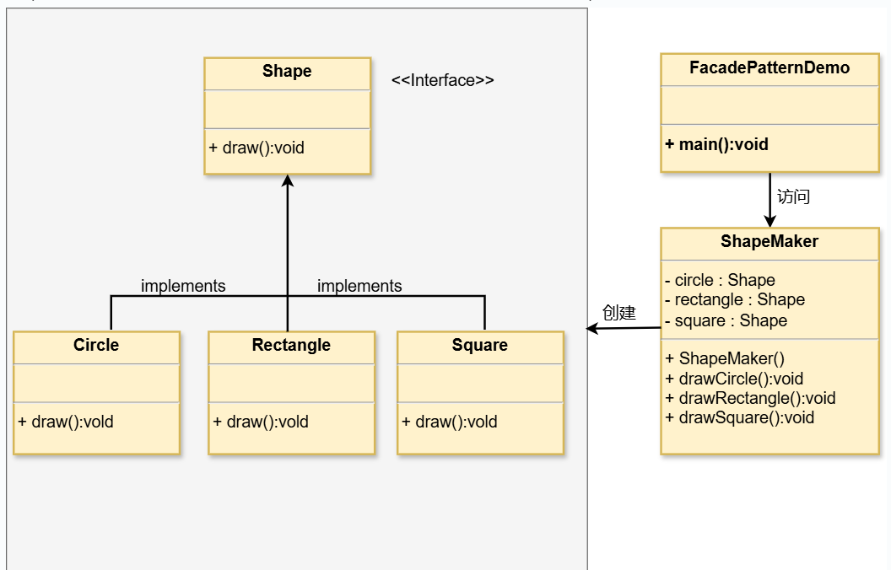

```c++
#include <bits/stdc++.h>
using namespace std;

// 披萨基类
class Pizza
{
public:
    virtual void prepare() = 0;
    virtual void bake() = 0;
    virtual void cut() = 0;
    virtual void box() = 0;
    virtual ~Pizza() {}
};

// 奶酪披萨类
class CheesePizza : public Pizza
{
public:
    void prepare() override
    {
        cout << "Prepare cheese pizza" << endl;
    }
    void bake() override
    {
        cout << "Bake cheese pizza" << endl;
    }
    void cut() override
    {
        cout << "Cut cheese pizza" << endl;
    }
    void box() override
    {
        cout << "Box cheese pizza" << endl;
    }
};

// 香肠披萨类
class PepperoniPizza : public Pizza
{
public:
    void prepare() override
    {
        cout << "Prepare pepperoni pizza" << endl;
    }
    void bake() override
    {
        cout << "Bake pepperoni pizza" << endl;
    }
    void cut() override
    {
        cout << "Cut pepperoni pizza" << endl;
    }
    void box() override
    {
        cout << "Box pepperoni pizza" << endl;
    }
};

// 海鲜披萨类
class SeafoodPizza : public Pizza
{
public:
    void prepare() override
    {
        cout << "Prepare seafood pizza" << endl;
    }
    void bake() override
    {
        cout << "Bake seafood pizza" << endl;
    }
    void cut() override
    {
        cout << "Cut seafood pizza" << endl;
    }
    void box() override
    {
        cout << "Box seafood pizza" << endl;
    }
};

// 抽象制作类
class Maker
{
protected:
    Pizza *cheesePizza;
    Pizza *pepperoniPizza;
    Pizza *seafoodPizza;

public:
    Maker()
    {
        cheesePizza = new CheesePizza();
        pepperoniPizza = new PepperoniPizza();
        seafoodPizza = new SeafoodPizza();
    }

    ~Maker()
    {
        delete cheesePizza;
        delete pepperoniPizza;
        delete seafoodPizza;
    }

    void makeCheesePizza()
    {
        cheesePizza->prepare();
        cheesePizza->bake();
        cheesePizza->cut();
        cheesePizza->box();
    }

    void makePepperoniPizza()
    {
        pepperoniPizza->prepare();
        pepperoniPizza->bake();
        pepperoniPizza->cut();
        pepperoniPizza->box();
    }

    void makeSeafoodPizza()
    {
        seafoodPizza->prepare();
        seafoodPizza->bake();
        seafoodPizza->cut();
        seafoodPizza->box();
    }
};

// 外观类
class PizzaFacade
{
private:
    Maker *m_maker;

public:
    PizzaFacade()
    {
        m_maker = new Maker();
    }

    ~PizzaFacade()
    {
        delete m_maker;
    }

    void makePizza(const string &type)
    {
        if (type == "cheese")
        {
            m_maker->makeCheesePizza();
        }
        else if (type == "pepperoni")
        {
            m_maker->makePepperoniPizza();
        }
        else if (type == "seafood")
        {
            m_maker->makeSeafoodPizza();
        }
        else
        {
            cout << "Unknown pizza type" << endl;
        }
    }
};

int main()
{
    string pizzaType;
    cout << "Enter pizza type (cheese/pepperoni/seafood): ";
    cin >> pizzaType;

    PizzaFacade facade;
    facade.makePizza(pizzaType);

    return 0;
}
```

### 状态模式

状态模式允许一个对象在其内部状态改变时改变其行为，看起来就像是改变了其类一样。
状态模式解决对象行为依赖于其状态的问题，使得对象可以在状态变化时切换行为。

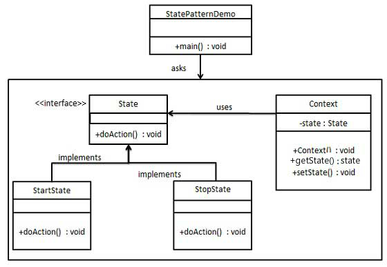

```c++
#include <bits/stdc++.h>

using namespace std;

// 状态接口
class State
{
public:
    virtual void doAction() = 0;
    virtual ~State() {}
};

// 具体状态类 - 准备状态
class PrepareState : public State
{
public:
    void doAction() override
    {
        cout << "Prepare pizza" << endl;
    }
};

// 具体状态类 - 烘焙状态
class BakeState : public State
{
public:
    void doAction() override
    {
        cout << "Bake pizza" << endl;
    }
};

// 具体状态类 - 切割状态
class CutState : public State
{
public:
    void doAction() override
    {
        cout << "Cut pizza" << endl;
    }
};

// 具体状态类 - 打包状态
class BoxState : public State
{
public:
    void doAction() override
    {
        cout << "Box pizza" << endl;
    }
};

// 披萨类（上下文）
class Pizza
{
private:
    State *currentState;
    string type;

public:
    Pizza(const string &pizzaType) : currentState(nullptr), type(pizzaType) {}

    void setState(State *state)
    {
        delete currentState; // 清理之前的状态
        currentState = state;
    }

    void prepare()
    {
        if (currentState)
        {
            currentState->doAction();
            cout << "Type: " << type << endl; // 打印当前披萨的类型
        }
    }

    ~Pizza()
    {
        delete currentState; // 清理当前状态
    }
};

// 外观类
class PizzaFacade
{
public:
    void makePizza(const string &type)
    {
        Pizza *pizza = new Pizza(type);

        pizza->setState(new PrepareState());
        pizza->prepare();

        pizza->setState(new BakeState());
        pizza->prepare();

        pizza->setState(new CutState());
        pizza->prepare();

        pizza->setState(new BoxState());
        pizza->prepare();

        delete pizza;
    }
};

int main()
{
    string pizzaType;
    cout << "Enter pizza type (cheese/pepperoni/seafood): ";
    cin >> pizzaType;

    PizzaFacade facade;
    facade.makePizza(pizzaType);

    return 0;
}
```

### 策略模式

策略模式将每个算法封装起来，使它们可以互换使用。
策略模式解决在多种相似算法存在时，使用条件语句（如 if...else）导致的复杂性和难以维护的问题。

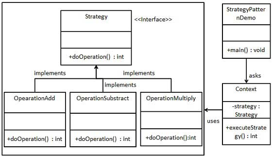

```c++
#include <bits/stdc++.h>

using namespace std;

// 策略接口
class PizzaMakingStrategy
{
public:
    virtual void make() = 0;
    virtual ~PizzaMakingStrategy() {}
};

// 具体策略类 - 准备披萨
class PreparePizza : public PizzaMakingStrategy
{
public:
    void make() override
    {
        cout << "Prepare pizza" << endl;
    }
};

// 具体策略类 - 烘焙披萨
class BakePizza : public PizzaMakingStrategy
{
public:
    void make() override
    {
        cout << "Bake pizza" << endl;
    }
};

// 具体策略类 - 切割披萨
class CutPizza : public PizzaMakingStrategy
{
public:
    void make() override
    {
        cout << "Cut pizza" << endl;
    }
};

// 具体策略类 - 打包披萨
class BoxPizza : public PizzaMakingStrategy
{
public:
    void make() override
    {
        cout << "Box pizza" << endl;
    }
};

// 披萨类（上下文）
class Pizza
{
private:
    string type;

public:
    Pizza(const string &pizzaType) : type(pizzaType) {}

    void makePizza(PizzaMakingStrategy *strategy)
    {
        if (strategy)
        {
            strategy->make();
            cout << "Type: " << type << endl; // 打印当前披萨的类型
        }
    }
};

// 外观类
class PizzaFacade
{
public:
    void makePizza(const string &type)
    {
        Pizza pizza(type);

        pizza.makePizza(new PreparePizza());
        pizza.makePizza(new BakePizza());
        pizza.makePizza(new CutPizza());
        pizza.makePizza(new BoxPizza());
    }
};

int main()
{
    string pizzaType;
    cout << "Enter pizza type (cheese/pepperoni/seafood): ";
    cin >> pizzaType;

    PizzaFacade facade;
    facade.makePizza(pizzaType);

    return 0;
}
```

### 代理模式

代理模式为其他对象提供一种代理以控制对这个对象的访问。
代理模式解决的是在直接访问某些对象时可能遇到的问题，例如对象创建成本高、需要安全控制或远程访问等。

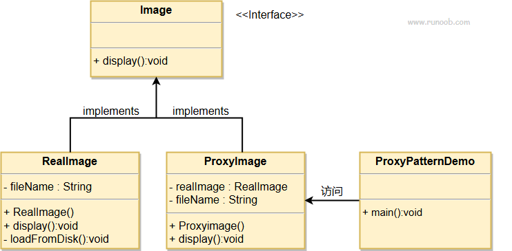

```c++
#include <bits/stdc++.h>

using namespace std;

// 图像接口
class Image
{
public:
    virtual void display() = 0;
    virtual ~Image() {}
};

// 真实图像类
class RealImage : public Image
{
private:
    string fileName;

public:
    RealImage(const string &file) : fileName(file)
    {
        loadFromDisk();
    }

    void loadFromDisk()
    {
        cout << "Loading " << fileName << " from disk." << endl;
    }

    void display() override
    {
        cout << "Displaying " << fileName << endl;
    }
};

// 代理图像类
class ProxyImage : public Image
{
private:
    RealImage *realImage;
    string fileName;
    mutable std::mutex mtx; // 用于线程安全

public:
    ProxyImage(const string &file) : realImage(nullptr), fileName(file) {}

    ~ProxyImage()
    {
        delete realImage; // 清理真实图像对象
    }

    void display() override
    {
        // 第一次检查
        if (realImage == nullptr)
        {
            // 锁定
            std::lock_guard<std::mutex> lock(mtx);
            // 第二次检查
            if (realImage == nullptr)
            {
                realImage = new RealImage(fileName); // 懒加载
            }
        }
        realImage->display();
    }
};

// 代理模式演示类
class ProxyPatternDemo
{
public:
    static void main()
    {
        Image *image1 = new ProxyImage("photo1.jpg");
        Image *image2 = new ProxyImage("photo2.jpg");

        // 第一次显示将加载图像
        image1->display();
        cout << endl;

        // 第二次显示将直接显示图像
        image1->display();
        cout << endl;

        // 显示另一张图片
        image2->display();
        cout << endl;

        // 清理内存
        delete image1;
        delete image2;
    }
};

int main()
{
    ProxyPatternDemo::main();
    return 0;
}
```

### 责任链模式

责任链模式可以解耦请求发送者和接收者，使多个对象都有可能接收请求，而发送者不需要知道哪个对象会处理它。

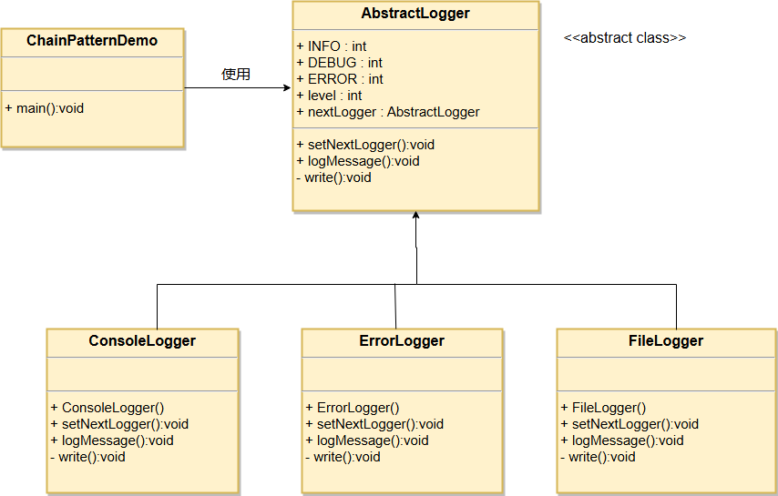

```c++
#include <bits/stdc++.h>

using namespace std;

// 抽象日志记录器类
class AbstractLogger
{
public:
    static const int INFO = 1;
    static const int DEBUG = 2;
    static const int ERROR = 3;

protected:
    int level;
    AbstractLogger *nextLogger;

public:
    void setNextLogger(AbstractLogger *nextLogger)
    {
        this->nextLogger = nextLogger;
    }

    void logMessage(int level, const string &message)
    {
        if (this->level <= level)
        {
            write(message);
        }
        if (nextLogger != nullptr)
        {
            nextLogger->logMessage(level, message);
        }
    }

protected:
    virtual void write(const string &message) = 0;
};

// 控制台日志记录器
class ConsoleLogger : public AbstractLogger
{
public:
    ConsoleLogger()
    {
        level = INFO;
    }

protected:
    void write(const string &message) override
    {
        cout << "Console Logger: " << message << endl;
    }
};

// 错误日志记录器
class ErrorLogger : public AbstractLogger
{
public:
    ErrorLogger()
    {
        level = ERROR;
    }

protected:
    void write(const string &message) override
    {
        cout << "Error Logger: " << message << endl;
    }
};

// 文件日志记录器
class FileLogger : public AbstractLogger
{
public:
    FileLogger()
    {
        level = DEBUG;
    }

protected:
    void write(const string &message) override
    {
        cout << "File Logger: " << message << endl;
    }
};

// 责任链模式演示类
class ChainPatternDemo
{
public:
    static void main()
    {
        // 创建日志记录器
        AbstractLogger *consoleLogger = new ConsoleLogger();
        AbstractLogger *fileLogger = new FileLogger();
        AbstractLogger *errorLogger = new ErrorLogger();

        // 设置责任链
        consoleLogger->setNextLogger(fileLogger);
        fileLogger->setNextLogger(errorLogger);

        // 发送日志消息
        consoleLogger->logMessage(AbstractLogger::INFO, "This is an information.");
        consoleLogger->logMessage(AbstractLogger::DEBUG, "This is a debug level log.");
        consoleLogger->logMessage(AbstractLogger::ERROR, "This is an error message.");

        // 清理内存
        delete consoleLogger;
        delete fileLogger;
        delete errorLogger;
    }
};

int main()
{
    ChainPatternDemo::main();
    return 0;
}
```

### 模板方法模式

模板模式在父类中定义了算法的骨架，并允许子类在不改变算法结构的前提下重定义算法的某些特定步骤。
模板模式解决在多个子类中重复实现相同的方法的问题，通过将通用方法抽象到父类中来避免代码重复。

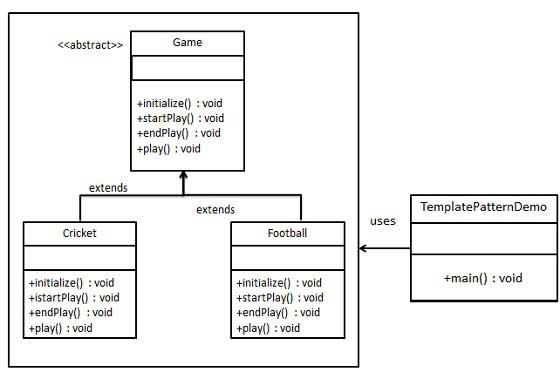

```c++
#include <bits/stdc++.h>

using namespace std;

class Game
{
public:
    void play()
    {
        initialize();
        startPlay();
        endPlay();
    }

protected:
    virtual void initialize() = 0;
    virtual void startPlay() = 0;
    virtual void endPlay() = 0;
};

class SwimmingGame : public Game
{
public:
    void initialize()
    {
        cout << "Swimming game initialized" << endl;
    }

    void startPlay()
    {
        cout << "Swimming game started" << endl;
    }

    void endPlay()
    {
        cout << "Swimming game ended" << endl;
    }
};

class FootballGame : public Game
{
public:
    void initialize()
    {
        cout << "Football game initialized" << endl;
    }

    void startPlay()
    {
        cout << "Football game started" << endl;
    }

    void endPlay()
    {
        cout << "Football game ended" << endl;
    }
};

int main()
{
    Game *swimming = new SwimmingGame();
    swimming->play();

    Game *football = new FootballGame();
    football->play();

    delete swimming;
    delete football;

    return 0;
}
```

### 享元模式

享元模式通过共享对象来减少创建大量相似对象时的内存消耗。
享元模式解决在系统中存在大量相同或相似对象时，消耗大量内存的问题。

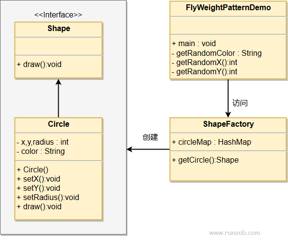

```c++
#include <bits/stdc++.h>

using namespace std;

// 享元接口
class Shape
{
public:
    virtual void draw() = 0; // 绘制形状
};

// 具体享元类
class Circle : public Shape
{
private:
    int x, y;     // 位置
    int radius;   // 半径
    string color; // 颜色

public:
    Circle(int x, int y, int radius, const string &color)
        : x(x), y(y), radius(radius), color(color) {}

    void draw() override
    {
        cout << "Circle: Draw() ["
             << "Color: " << color
             << ", Radius: " << radius
             << ", X: " << x
             << ", Y: " << y << "]" << endl;
    }

    void setX(int x) { this->x = x; }
    void setY(int y) { this->y = y; }
    void setRadius(int radius) { this->radius = radius; }
};

// 享元工厂
class ShapeFactory
{
private:
    map<string, shared_ptr<Shape>> circleMap; // 形状缓存

public:
    shared_ptr<Shape> getCircle(const string &color)
    {
        auto it = circleMap.find(color);
        if (it != circleMap.end())
        {
            return it->second; // 返回已有的实例
        }
        else
        {
            shared_ptr<Shape> circle = make_shared<Circle>(0, 0, 10, color); // 默认位置和半径
            circleMap[color] = circle;                                       // 存入缓存
            return circle;
        }
    }
};

// 演示类
class FlyWeightPatternDemo
{
public:
    // 随机颜色生成
    string getRandomColor()
    {
        const string colors[] = {"Red", "Green", "Blue", "Black", "White"};
        return colors[rand() % 5];
    }

    // 随机X坐标生成
    int getRandomX()
    {
        return rand() % 100;
    }

    // 随机Y坐标生成
    int getRandomY()
    {
        return rand() % 100;
    }

    void main()
    {
        srand(static_cast<unsigned>(time(0))); // 用于随机数种子

        ShapeFactory shapeFactory;
        vector<shared_ptr<Shape>> shapes;

        // 创建100个圆圈
        for (int i = 0; i < 100; ++i)
        {
            string color = getRandomColor();
            shared_ptr<Shape> circle = shapeFactory.getCircle(color);

            if (auto c = dynamic_cast<Circle *>(circle.get()))
            {
                c->setX(getRandomX());
                c->setY(getRandomY());
            }

            shapes.push_back(circle);
        }

        // 绘制所有圆圈
        for (const auto &shape : shapes)
        {
            shape->draw();
        }
    }
};

// 主函数
int main()
{
    FlyWeightPatternDemo demo;
    demo.main(); // 执行演示
    return 0;
}
```

### 命令模式

命令模式将一个请求封装为一个对象，从而使你可以用不同的请求对客户进行参数化，对请求排队或记录请求日志，以及支持可撤销的操作。
命令模式解决在软件系统中请求者和执行者之间的紧耦合问题，特别是在需要对行为进行记录、撤销/重做或事务处理等场景。

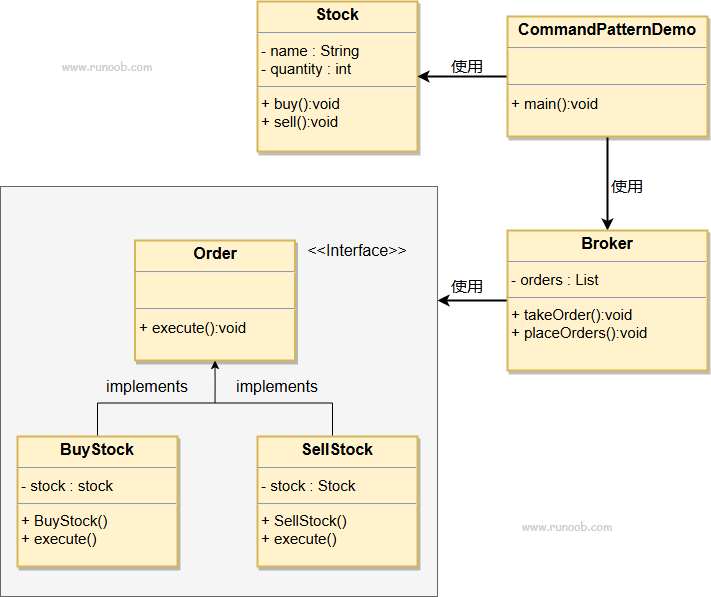

```c++
#include <bits/stdc++.h>

using namespace std;

// 股票类
class Stock
{
private:
    string name;
    int quantity;

public:
    Stock(const string &name, int quantity) : name(name), quantity(quantity) {}

    void buy()
    {
        cout << "Buying " << quantity << " shares of " << name << "." << endl;
    }

    void sell()
    {
        cout << "Selling " << quantity << " shares of " << name << "." << endl;
    }
};

// 命令接口
class Order
{
public:
    virtual void execute() = 0; // 执行命令
};

// 买入命令类
class BuyStock : public Order
{
private:
    Stock &stock;

public:
    BuyStock(Stock &stock) : stock(stock) {}

    void execute() override
    {
        stock.buy(); // 调用股票的买入方法
    }
};

// 卖出命令类
class SellStock : public Order
{
private:
    Stock &stock;

public:
    SellStock(Stock &stock) : stock(stock) {}

    void execute() override
    {
        stock.sell(); // 调用股票的卖出方法
    }
};

// 经纪人类
class Broker
{
private:
    vector<shared_ptr<Order>> orders; // 存储命令的列表

public:
    void takeOrder(shared_ptr<Order> order)
    {
        orders.push_back(order); // 存储命令
    }

    void placeOrders()
    {
        for (const auto &order : orders)
        {
            order->execute(); // 执行所有命令
        }
        orders.clear(); // 清空命令列表
    }
};

// 用于演示的主方法
class CommandPatternDemo
{
public:
    void main()
    {
        Stock stock("AAPL", 100); // 创建一个股票实例

        // 创建命令实例
        shared_ptr<Order> buyOrder = make_shared<BuyStock>(stock);
        shared_ptr<Order> sellOrder = make_shared<SellStock>(stock);

        // 创建经纪人实例
        Broker broker;
        broker.takeOrder(buyOrder);  // 添加买入命令
        broker.takeOrder(sellOrder); // 添加卖出命令

        // 执行命令
        broker.placeOrders();
    }
};

// 主函数
int main()
{
    CommandPatternDemo demo;
    demo.main(); // 执行演示
    return 0;
}
```

### 生成器模式(建造者模式)

生成器模式将一个复杂的构建过程与其表示相分离，使得同样的构建过程可以创建不同的表示。
生成器模式可以解决以下问题：在软件系统中，一个复杂对象的创建通常由多个部分组成，这些部分的组合经常变化，但组合的算法相对稳定。

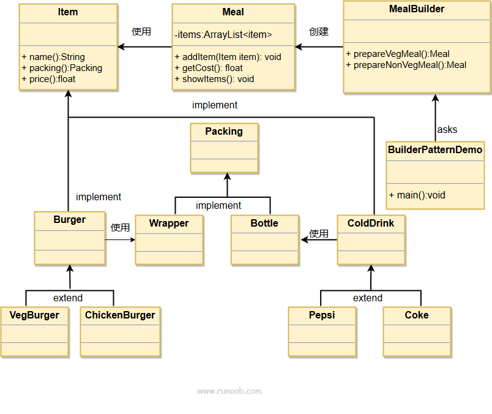

```c++
#include <bits/stdc++.h>

using namespace std;

// 抽象物品接口
class Item
{
public:
    virtual string name() = 0;
    virtual float price() = 0;
    virtual string packing() = 0;
};

// 抽象包装类
class Packing
{
public:
    virtual string pack() = 0;
};

// 包装类：Wrapper
class Wrapper : public Packing
{
public:
    string pack() override
    {
        return "Wrapper";
    }
};

// 包装类：Bottle
class Bottle : public Packing
{
public:
    string pack() override
    {
        return "Bottle";
    }
};

// 抽象饮料类（冷饮）
class ColdDrink : public Item
{
public:
    virtual string packing() = 0;
};

// 具体饮料类：Pepsi
class Pepsi : public ColdDrink
{
public:
    string name() override
    {
        return "Pepsi";
    }

    float price() override
    {
        return 1.5;
    }

    string packing() override
    {
        return Bottle().pack();
    }
};

// 具体饮料类：Coke
class Coke : public ColdDrink
{
public:
    string name() override
    {
        return "Coke";
    }

    float price() override
    {
        return 1.0;
    }

    string packing() override
    {
        return Bottle().pack();
    }
};

// 抽象汉堡类
class Burger : public Item
{
public:
    virtual string packing() = 0;
};

// 具体汉堡类：VegBurger
class VegBurger : public Burger
{
public:
    string name() override
    {
        return "Veg Burger";
    }

    float price() override
    {
        return 2.5;
    }

    string packing() override
    {
        return Wrapper().pack();
    }
};

// 具体汉堡类：ChickenBurger
class ChickenBurger : public Burger
{
public:
    string name() override
    {
        return "Chicken Burger";
    }

    float price() override
    {
        return 3.0;
    }

    string packing() override
    {
        return Wrapper().pack();
    }
};

// 餐点类
class Meal
{
private:
    vector<shared_ptr<Item>> items;

public:
    void addItem(shared_ptr<Item> item)
    {
        items.push_back(item);
    }

    float getCost()
    {
        float cost = 0;
        for (const auto &item : items)
        {
            cost += item->price();
        }
        return cost;
    }

    void showItems()
    {
        for (const auto &item : items)
        {
            cout << "Item: " << item->name() << ", Packing: " << item->packing() << ", Price: " << item->price() << endl;
        }
    }
};

// 建造者类
class MealBuilder
{
public:
    Meal prepareVegMeal()
    {
        Meal meal;
        meal.addItem(make_shared<VegBurger>());
        meal.addItem(make_shared<Pepsi>());
        return meal;
    }

    Meal prepareNonVegMeal()
    {
        Meal meal;
        meal.addItem(make_shared<ChickenBurger>());
        meal.addItem(make_shared<Coke>());
        return meal;
    }
};

// 演示类
class BuilderPatternDemo
{
public:
    void main()
    {
        MealBuilder mealBuilder;

        // 准备素食餐
        Meal vegMeal = mealBuilder.prepareVegMeal();
        cout << "Veg Meal:" << endl;
        vegMeal.showItems();
        cout << "Total Cost: " << vegMeal.getCost() << endl;

        cout << endl;

        // 准备非素食餐
        Meal nonVegMeal = mealBuilder.prepareNonVegMeal();
        cout << "Non-Veg Meal:" << endl;
        nonVegMeal.showItems();
        cout << "Total Cost: " << nonVegMeal.getCost() << endl;
    }
};

// 主函数
int main()
{
    BuilderPatternDemo demo;
    demo.main(); // 执行演示
    return 0;
}
```

### 原型模式

原型模式实现了一个原型接口，该接口用于创建当前对象的克隆。当直接创建对象的代价比较大时，则采用这种模式。例如，一个对象需要在一个高代价的数据库操作之后被创建。我们可以缓存该对象，在下一个请求时返回它的克隆，在需要的时候更新数据库，以此来减少数据库调用。

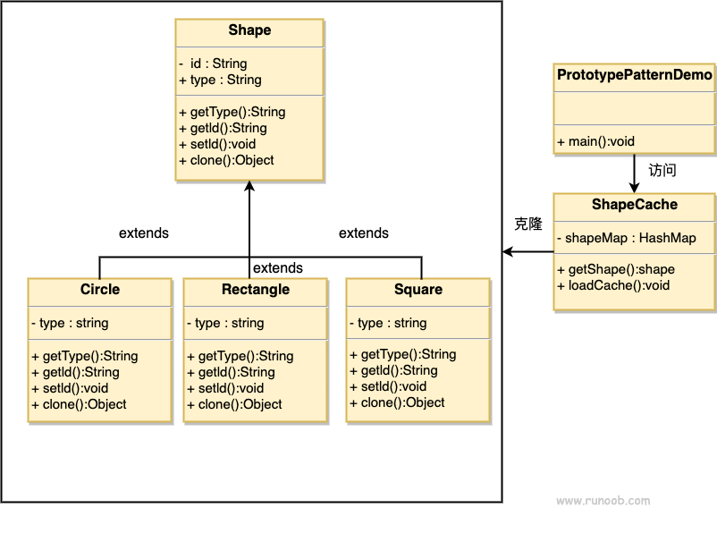

```c++
#include <bits/stdc++.h>

using namespace std;

// 抽象基类 Shape
class Shape
{
protected:
    string id;
    string type;

public:
    virtual ~Shape() = default;

    virtual string getType() const = 0;                     // 获取形状类型
    virtual string getId() const { return id; }             // 获取ID
    virtual void setId(const string &id) { this->id = id; } // 设置ID
    virtual unique_ptr<Shape> clone() const = 0;            // 克隆方法
};

// 具体类 Circle
class Circle : public Shape
{
public:
    Circle()
    {
        type = "Circle"; // 设置类型
    }

    string getType() const override
    {
        return type;
    }

    unique_ptr<Shape> clone() const override
    {
        return make_unique<Circle>(*this);
    }
};

// 具体类 Rectangle
class Rectangle : public Shape
{
public:
    Rectangle()
    {
        type = "Rectangle"; // 设置类型
    }

    string getType() const override
    {
        return type;
    }

    unique_ptr<Shape> clone() const override
    {
        return make_unique<Rectangle>(*this);
    }
};

// 具体类 Square
class Square : public Shape
{
public:
    Square()
    {
        type = "Square"; // 设置类型
    }

    string getType() const override
    {
        return type;
    }

    unique_ptr<Shape> clone() const override
    {
        return make_unique<Square>(*this);
    }
};

// 缓存类 ShapeCache
class ShapeCache
{
private:
    unordered_map<string, unique_ptr<Shape>> shapeMap;

public:
    void loadCache()
    {
        // 加载形状到缓存
        auto circle = make_unique<Circle>();
        circle->setId("1");
        shapeMap[circle->getId()] = move(circle);

        auto rectangle = make_unique<Rectangle>();
        rectangle->setId("2");
        shapeMap[rectangle->getId()] = move(rectangle);

        auto square = make_unique<Square>();
        square->setId("3");
        shapeMap[square->getId()] = move(square);
    }

    unique_ptr<Shape> getShape(const string &shapeId)
    {
        auto it = shapeMap.find(shapeId);
        if (it != shapeMap.end())
        {
            return it->second->clone(); // 返回克隆的形状
        }
        return nullptr;
    }
};

// 演示类 PrototypePatternDemo
class PrototypePatternDemo
{
public:
    void main()
    {
        ShapeCache shapeCache;
        shapeCache.loadCache(); // 加载缓存

        // 从缓存获取克隆的形状
        unique_ptr<Shape> shape1 = shapeCache.getShape("1");
        cout << "Shape : " << shape1->getType() << ", ID : " << shape1->getId() << endl;

        unique_ptr<Shape> shape2 = shapeCache.getShape("2");
        cout << "Shape : " << shape2->getType() << ", ID : " << shape2->getId() << endl;

        unique_ptr<Shape> shape3 = shapeCache.getShape("3");
        cout << "Shape : " << shape3->getType() << ", ID : " << shape3->getId() << endl;
    }
};

// 主函数
int main()
{
    PrototypePatternDemo demo;
    demo.main(); // 执行演示
    return 0;
}
```

### 备忘录模式

备忘录模式可以在不破坏封装性的前提下，捕获一个对象的内部状态，并允许在对象之外保存和恢复这些状态。
备忘录模式允许捕获并保存一个对象的内部状态，以便在将来可以恢复到该状态，实现撤销和回滚操作。

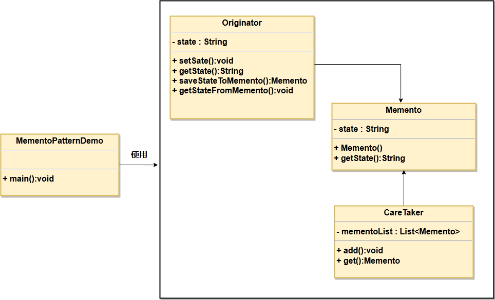

```c++
#include <bits/stdc++.h>

using namespace std;

// 备忘录类
class Memento
{
private:
    string state;

public:
    Memento(const string &state) : state(state) {}

    string getState() const
    {
        return state;
    }
};

// 发起人类
class Originator
{
private:
    string state;

public:
    void setState(const string &state)
    {
        this->state = state;
    }

    string getState() const
    {
        return state;
    }

    unique_ptr<Memento> saveStateToMemento()
    {
        return make_unique<Memento>(state); // 保存状态到备忘录
    }

    void getStateFromMemento(const Memento &memento)
    {
        state = memento.getState(); // 从备忘录恢复状态
    }
};

// 管理者类
class CareTaker
{
private:
    vector<unique_ptr<Memento>> mementoList; // 备忘录列表

public:
    void add(unique_ptr<Memento> memento)
    {
        mementoList.push_back(move(memento)); // 添加备忘录
    }

    unique_ptr<Memento> get(int index)
    {
        if (index >= 0 && index < mementoList.size())
        {
            return make_unique<Memento>(*(mementoList[index])); // 返回备忘录
        }
        return nullptr;
    }
};

// 备忘录模式演示类
class MementoPatternDemo
{
public:
    void main()
    {
        Originator originator;
        CareTaker careTaker;

        // 修改状态并保存
        originator.setState("State #1");
        careTaker.add(originator.saveStateToMemento());

        originator.setState("State #2");
        careTaker.add(originator.saveStateToMemento());

        originator.setState("State #3");
        careTaker.add(originator.saveStateToMemento());

        // 恢复状态
        originator.getStateFromMemento(*careTaker.get(0)); // 恢复到State #1
        cout << "Restored State: " << originator.getState() << endl;

        originator.getStateFromMemento(*careTaker.get(1)); // 恢复到State #2
        cout << "Restored State: " << originator.getState() << endl;

        originator.getStateFromMemento(*careTaker.get(2)); // 恢复到State #3
        cout << "Restored State: " << originator.getState() << endl;
    }
};

// 主函数
int main()
{
    MementoPatternDemo demo;
    demo.main(); // 执行演示
    return 0;
}
```

### 迭代器模式

迭代器模式可以提供一种方法顺序访问一个聚合对象中的各个元素，而又不暴露其内部的表示。
迭代器模式提供一种统一的方法来遍历不同的聚合对象。

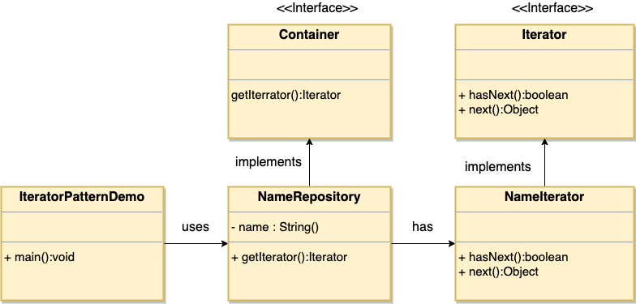

```c++
#include <bits/stdc++.h>

using namespace std;

// 迭代器接口
class Iterator
{
public:
    virtual ~Iterator() = default;
    virtual bool hasNext() const = 0; // 检查是否有下一个元素
    virtual string next() = 0;        // 获取下一个元素
};

// 容器接口
class Container
{
public:
    virtual ~Container() = default;
    virtual unique_ptr<Iterator> getIterator() const = 0; // 获取迭代器
};

// 具体迭代器类
class NameIterator : public Iterator
{
private:
    const vector<string> &names; // 名称集合
    size_t index;                // 当前索引

public:
    NameIterator(const vector<string> &names) : names(names), index(0) {}

    bool hasNext() const override
    {
        return index < names.size(); // 判断是否还有下一个元素
    }

    string next() override
    {
        if (hasNext())
        {
            return names[index++]; // 返回下一个元素
        }
        return ""; // 如果没有，则返回空字符串
    }
};

// 具体容器类
class NameRepository : public Container
{
private:
    vector<string> names; // 名称集合

public:
    NameRepository()
    {
        names = {"John", "Jane", "Jack", "Jill"}; // 添加一些名称
    }

    unique_ptr<Iterator> getIterator() const override
    {
        return make_unique<NameIterator>(names); // 返回名称迭代器
    }
};

// 迭代器模式演示类
class IteratorPatternDemo
{
public:
    void main()
    {
        NameRepository nameRepository;                                // 创建名称集合
        unique_ptr<Iterator> iterator = nameRepository.getIterator(); // 获取迭代器

        // 迭代并打印名称
        while (iterator->hasNext())
        {
            cout << iterator->next() << endl;
        }
    }
};

// 主函数
int main()
{
    IteratorPatternDemo demo;
    demo.main(); // 执行演示
    return 0;
}
```

### 组合模式

组合模式将对象组合成树形结构以表示"部分-整体"的层次结构。组合模式使得用户对单个对象和组合对象的使用具有一致性。
组合模式可以简化树形结构中对象的处理，无论它们是单个对象还是组合对象，解耦客户端代码与复杂元素的内部结构，使得客户端可以统一处理所有类型的节点。

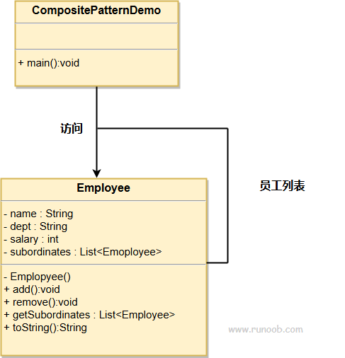

```c++
#include <bits/stdc++.h>

using namespace std;

// 员工类
class Employee
{
private:
    string name;                               // 员工姓名
    string dept;                               // 部门
    int salary;                                // 工资
    vector<unique_ptr<Employee>> subordinates; // 下属员工

public:
    Employee(const string &name, const string &dept, int salary)
        : name(name), dept(dept), salary(salary) {}

    void add(unique_ptr<Employee> employee)
    {
        subordinates.push_back(move(employee)); // 添加下属员工
    }

    void remove(const string &name)
    {
        auto it = remove_if(subordinates.begin(), subordinates.end(),
                            [&name](const unique_ptr<Employee> &e)
                            {
                                return e->toString() == name; // 按名称删除下属
                            });
        subordinates.erase(it, subordinates.end());
    }

    vector<unique_ptr<Employee>> &getSubordinates()
    {
        return subordinates; // 获取下属列表
    }

    string toString() const
    {
        return name + " (" + dept + ", $" + to_string(salary) + ")";
    }
};

// 组合模式演示类
class CompositePatternDemo
{
public:
    void main()
    {
        // 创建员工
        auto manager = make_unique<Employee>("Alice", "Management", 90000);
        auto emp1 = make_unique<Employee>("Bob", "Development", 60000);
        auto emp2 = make_unique<Employee>("Charlie", "Development", 70000);
        auto emp3 = make_unique<Employee>("David", "HR", 50000);

        // 添加下属
        manager->add(move(emp1));
        manager->add(move(emp2));
        manager->add(move(emp3));

        // 打印员工信息
        cout << "Manager: " << manager->toString() << endl;
        cout << "Subordinates:" << endl;

        for (const auto &sub : manager->getSubordinates())
        {
            cout << " - " << sub->toString() << endl;
        }
    }
};

// 主函数
int main()
{
    CompositePatternDemo demo;
    demo.main(); // 执行演示
    return 0;
}
```

### 桥接模式

桥接模式用于将抽象部分与实现部分分离，使得它们可以独立地变化。
桥接模式避免了使用继承导致的类爆炸问题，提供更灵活的扩展方式。

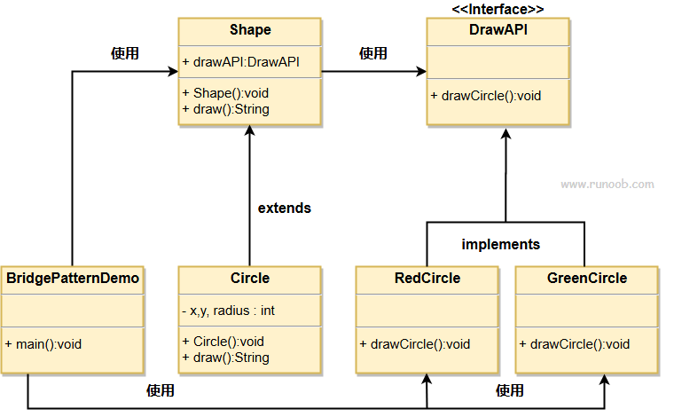

```c++
#include <bits/stdc++.h>

using namespace std;

// 抽象接口 DrawAPI
class DrawAPI
{
public:
    virtual ~DrawAPI() = default;
    virtual void drawCircle(int radius, int x, int y) = 0; // 绘制圆的方法
};

// 具体实现类 RedCircle
class RedCircle : public DrawAPI
{
public:
    void drawCircle(int radius, int x, int y) override
    {
        cout << "Drawing Circle[ Color: Red, Radius: " << radius
             << ", X: " << x << ", Y: " << y << "]" << endl;
    }
};

// 具体实现类 GreenCircle
class GreenCircle : public DrawAPI
{
public:
    void drawCircle(int radius, int x, int y) override
    {
        cout << "Drawing Circle[ Color: Green, Radius: " << radius
             << ", X: " << x << ", Y: " << y << "]" << endl;
    }
};

// 抽象类 Shape
class Shape
{
protected:
    unique_ptr<DrawAPI> drawAPI; // 持有一个实现抽象

public:
    Shape(unique_ptr<DrawAPI> drawAPI) : drawAPI(move(drawAPI)) {} // 修正构造函数
    virtual ~Shape() = default;
    virtual void draw() = 0; // 绘制方法的抽象
};

// 具体类 Circle
class Circle : public Shape
{
private:
    int x, y, radius;

public:
    Circle(int x, int y, int radius, unique_ptr<DrawAPI> drawAPI)
        : Shape(move(drawAPI)), x(x), y(y), radius(radius) {} // 修正构造函数

    void draw() override
    {
        drawAPI->drawCircle(radius, x, y); // 委托实现类绘制
    }
};

// 桥接模式演示类
class BridgePatternDemo
{
public:
    void main()
    {
        unique_ptr<Shape> redCircle = make_unique<Circle>(100, 100, 10, make_unique<RedCircle>());
        unique_ptr<Shape> greenCircle = make_unique<Circle>(100, 100, 10, make_unique<GreenCircle>());

        redCircle->draw();   // 绘制红色圆
        greenCircle->draw(); // 绘制绿色圆
    }
};

// 主函数
int main()
{
    BridgePatternDemo demo;
    demo.main(); // 执行演示
    return 0;
}
```

### 中介者模式

中介者模式通过引入一个中介者对象来封装和协调多个对象之间的交互，从而降低对象间的耦合度。
中介者模式解决对象间复杂的一对多关联问题，避免对象之间的高度耦合，简化系统结构。

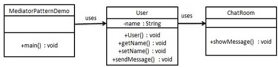

```c++
#include <bits/stdc++.h>

using namespace std;

// 前向声明
class User;

// 中介者接口
class ChatRoom
{
public:
    virtual void showMessage(const User &user, const string &message) = 0; // 显示消息
};

// 用户类
class User
{
private:
    string name;                   // 用户名
    shared_ptr<ChatRoom> chatRoom; // 中介者引用

public:
    User(const string &name, shared_ptr<ChatRoom> chatRoom) : name(name), chatRoom(chatRoom) {}

    string getName() const
    {
        return name;
    }

    void setName(const string &name)
    {
        this->name = name;
    }

    void sendMessage(const string &message)
    {
        chatRoom->showMessage(*this, message); // 发送消息
    }
};

// 具体中介者实现类
class ChatRoomImpl : public ChatRoom
{
public:
    void showMessage(const User &user, const string &message) override
    {
        cout << user.getName() << ": " << message << endl; // 显示用户发送的消息
    }
};

// 中介者模式演示类
class MediatorPatternDemo
{
public:
    void main()
    {
        auto chatRoom = make_shared<ChatRoomImpl>(); // 创建聊天房间

        User user1("Alice", chatRoom);
        User user2("Bob", chatRoom);

        user1.sendMessage("Hello, Bob!");             // 用户1发送消息
        user2.sendMessage("Hi, Alice! How are you?"); // 用户2发送消息
    }
};

// 主函数
int main()
{
    MediatorPatternDemo demo;
    demo.main(); // 执行演示
    return 0;
}
```

### 访问者模式

访问者模式旨在将数据结构与在该数据结构上执行的操作分离，从而使得添加新的操作变得更容易，而无需修改数据结构本身。
访问者模式解决在稳定数据结构和易变操作之间的耦合问题，使得操作可以独立于数据结构变化。

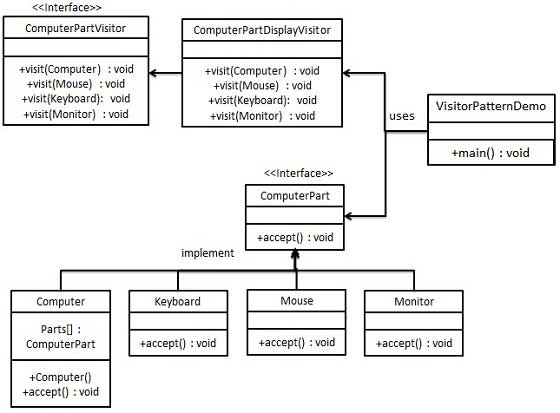

```c++
#include <bits/stdc++.h>

using namespace std;

// 前向声明
class Computer;
class ComputerPartVisitor;

// 抽象的计算机部件接口
class ComputerPart : public enable_shared_from_this<ComputerPart>
{
public:
    virtual ~ComputerPart() = default;
    virtual void accept(shared_ptr<ComputerPartVisitor> visitor) = 0; // 接受访问者
};

// 具体的计算机类
class Computer : public ComputerPart
{
public:
    void accept(shared_ptr<ComputerPartVisitor> visitor) override; // 继承自 ComputerPart
};

// 具体的键盘类
class Keyboard : public ComputerPart
{
public:
    void accept(shared_ptr<ComputerPartVisitor> visitor) override; // 继承自 ComputerPart
};

// 具体的鼠标类
class Mouse : public ComputerPart
{
public:
    void accept(shared_ptr<ComputerPartVisitor> visitor) override; // 继承自 ComputerPart
};

// 具体的显示器类
class Monitor : public ComputerPart
{
public:
    void accept(shared_ptr<ComputerPartVisitor> visitor) override; // 继承自 ComputerPart
};

// 访问者接口
class ComputerPartVisitor
{
public:
    virtual ~ComputerPartVisitor() = default;
    virtual void visit(shared_ptr<Computer> computer) = 0; // 访问计算机
    virtual void visit(shared_ptr<Mouse> mouse) = 0;       // 访问鼠标
    virtual void visit(shared_ptr<Keyboard> keyboard) = 0; // 访问键盘
    virtual void visit(shared_ptr<Monitor> monitor) = 0;   // 访问显示器
};

// 具体的访问者
class ComputerPartDisplayVisitor : public ComputerPartVisitor
{
public:
    void visit(shared_ptr<Computer> computer) override
    {
        cout << "Displaying Computer." << endl;
    }

    void visit(shared_ptr<Mouse> mouse) override
    {
        cout << "Displaying Mouse." << endl;
    }

    void visit(shared_ptr<Keyboard> keyboard) override
    {
        cout << "Displaying Keyboard." << endl;
    }

    void visit(shared_ptr<Monitor> monitor) override
    {
        cout << "Displaying Monitor." << endl;
    }
};

// Computer类的accept方法实现
void Computer::accept(shared_ptr<ComputerPartVisitor> visitor)
{
    visitor->visit(static_pointer_cast<Computer>(shared_from_this())); // 访问者访问计算机
}

// Keyboard类的accept方法实现
void Keyboard::accept(shared_ptr<ComputerPartVisitor> visitor)
{
    visitor->visit(static_pointer_cast<Keyboard>(shared_from_this())); // 访问者访问键盘
}

// Mouse类的accept方法实现
void Mouse::accept(shared_ptr<ComputerPartVisitor> visitor)
{
    visitor->visit(static_pointer_cast<Mouse>(shared_from_this())); // 访问者访问鼠标
}

// Monitor类的accept方法实现
void Monitor::accept(shared_ptr<ComputerPartVisitor> visitor)
{
    visitor->visit(static_pointer_cast<Monitor>(shared_from_this())); // 访问者访问显示器
}

// 示例代码
class VisitorPatternDemo
{
public:
    void main()
    {
        vector<shared_ptr<ComputerPart>> parts; // 创建计算机部件集合
        parts.push_back(make_shared<Computer>());
        parts.push_back(make_shared<Mouse>());
        parts.push_back(make_shared<Keyboard>());
        parts.push_back(make_shared<Monitor>());

        shared_ptr<ComputerPartVisitor> visitor = make_shared<ComputerPartDisplayVisitor>();

        // 访问每个部件
        for (const auto &part : parts)
        {
            part->accept(visitor);
        }
    }
};

// 主函数
int main()
{
    VisitorPatternDemo demo;
    demo.main(); // 执行演示
    return 0;
}
```

### 解释器模式

解释器模式定义一种语言的文法表示，并创建一个解释器，该解释器能够解释该语言中的句子。
解释器模式用于构建一个能够解释特定语言或文法的句子的解释器。
类似于编译原理文法。


```c++
#include <bits/stdc++.h>

using namespace std;

// 表达式接口
class Expression
{
public:
    virtual bool interpret() = 0; // 解析方法
};

// 终端表达式
class TerminalExpression : public Expression
{
private:
    string data;

public:
    TerminalExpression(const string &data) : data(data) {}

    bool interpret() override
    {
        // 自定义逻辑
        return data == "true"; // 如果数据是 "true"，返回 true
    }
};

// 与表达式
class AndExpression : public Expression
{
private:
    shared_ptr<Expression> expr1;
    shared_ptr<Expression> expr2;

public:
    AndExpression(shared_ptr<Expression> expr1, shared_ptr<Expression> expr2)
        : expr1(expr1), expr2(expr2) {}

    bool interpret() override
    {
        return expr1->interpret() && expr2->interpret(); // 逻辑与
    }
};

// 或表达式
class OrExpression : public Expression
{
private:
    shared_ptr<Expression> expr1;
    shared_ptr<Expression> expr2;

public:
    OrExpression(shared_ptr<Expression> expr1, shared_ptr<Expression> expr2)
        : expr1(expr1), expr2(expr2) {}

    bool interpret() override
    {
        return expr1->interpret() || expr2->interpret(); // 逻辑或
    }
};

// 解释器模式演示类
class InterpreterPatternDemo
{
public:
    void getMaleExpression()
    {
        // 定义表达式（true && false）
        shared_ptr<Expression> isMale = make_shared<TerminalExpression>("true");
        shared_ptr<Expression> isMarried = make_shared<TerminalExpression>("false");

        shared_ptr<Expression> andExpression = make_shared<AndExpression>(isMale, isMarried);
        cout << "Is Male and Married? : " << andExpression->interpret() << endl; // 输出 false
    }

    void getMarriedWomenExpression()
    {
        // 定义表达式（false || true）
        shared_ptr<Expression> isFemale = make_shared<TerminalExpression>("false");
        shared_ptr<Expression> isMarried = make_shared<TerminalExpression>("true");

        shared_ptr<Expression> orExpression = make_shared<OrExpression>(isFemale, isMarried);
        cout << "Is Female or Married? : " << orExpression->interpret() << endl; // 输出 true
    }
};

// 主函数
int main()
{
    InterpreterPatternDemo demo;
    demo.getMaleExpression();         // 检查男性信息
    demo.getMarriedWomenExpression(); // 检查女性结婚信息
    return 0;
}

```
