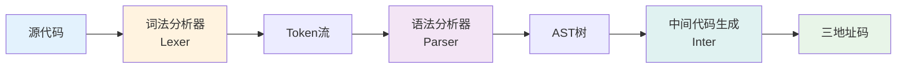
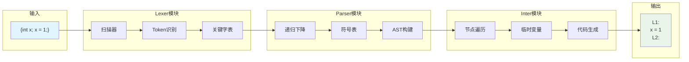
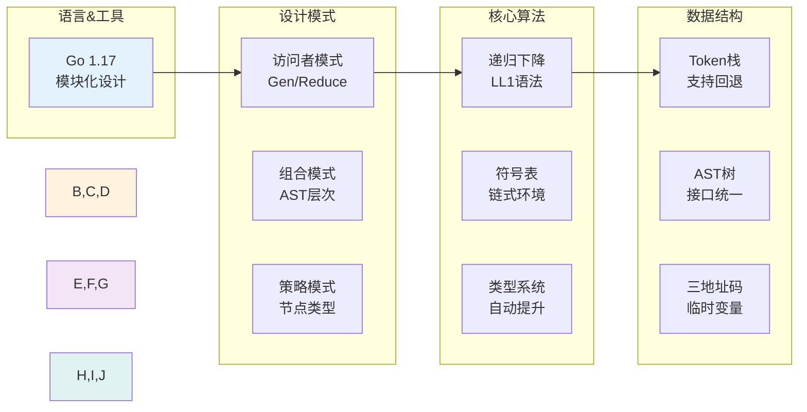
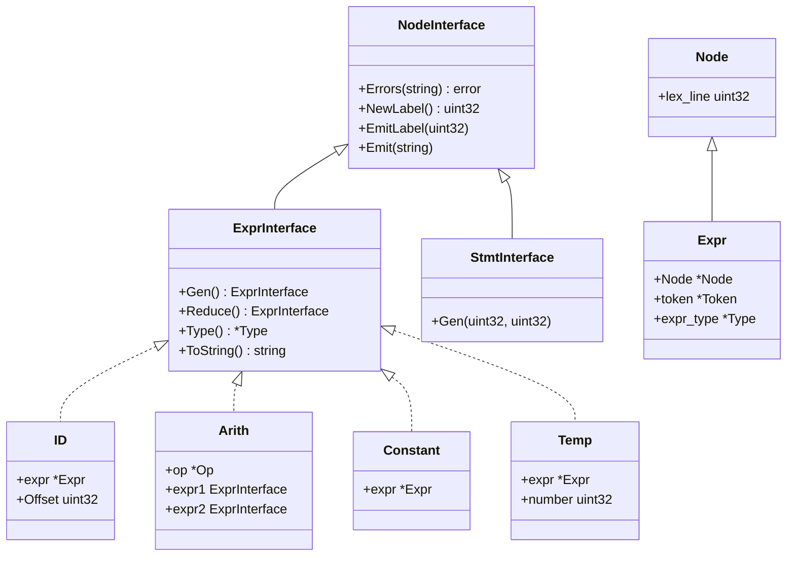
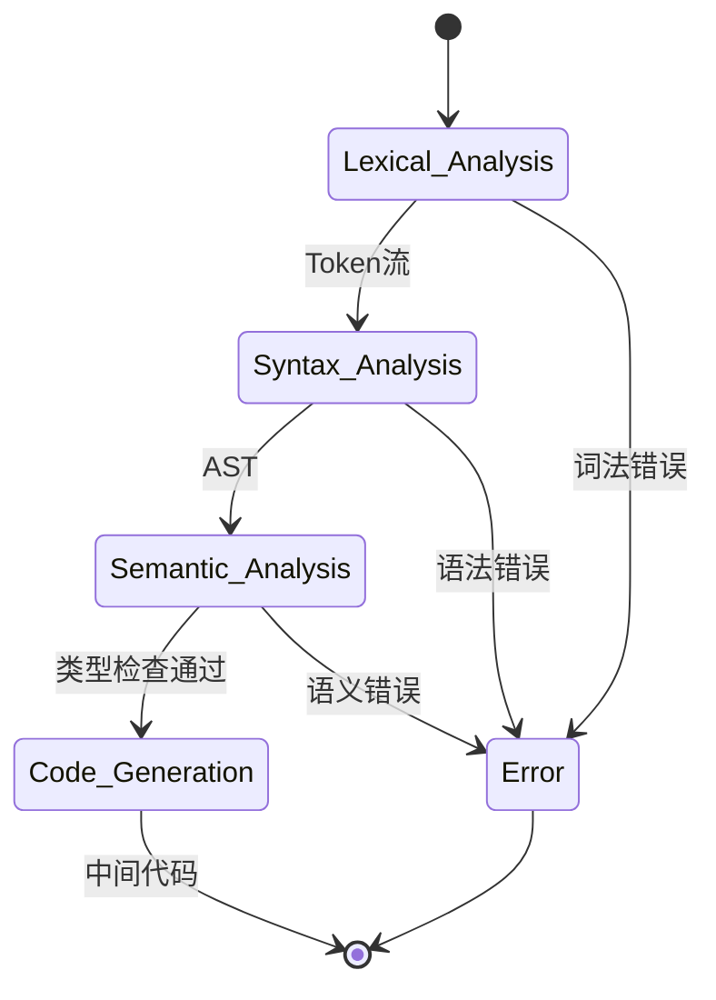
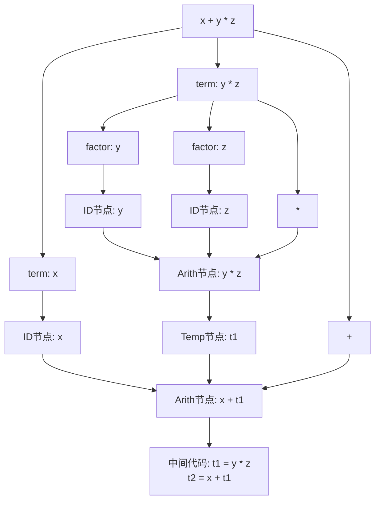
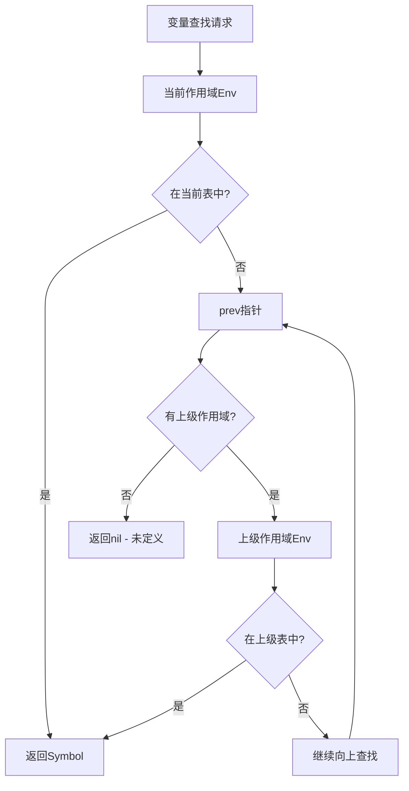
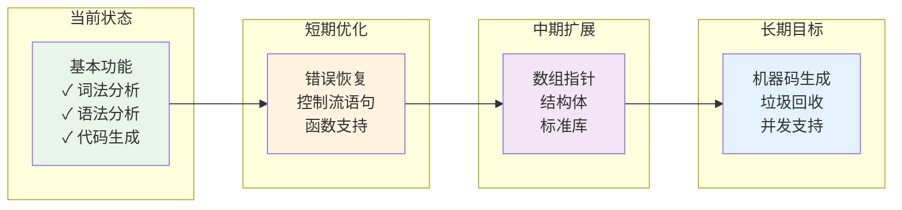
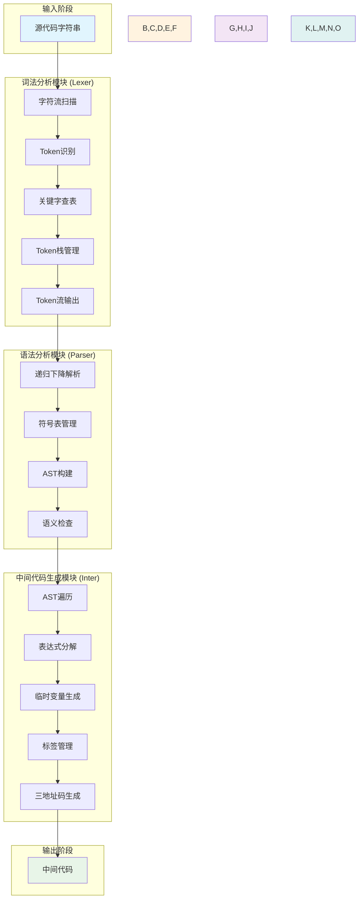
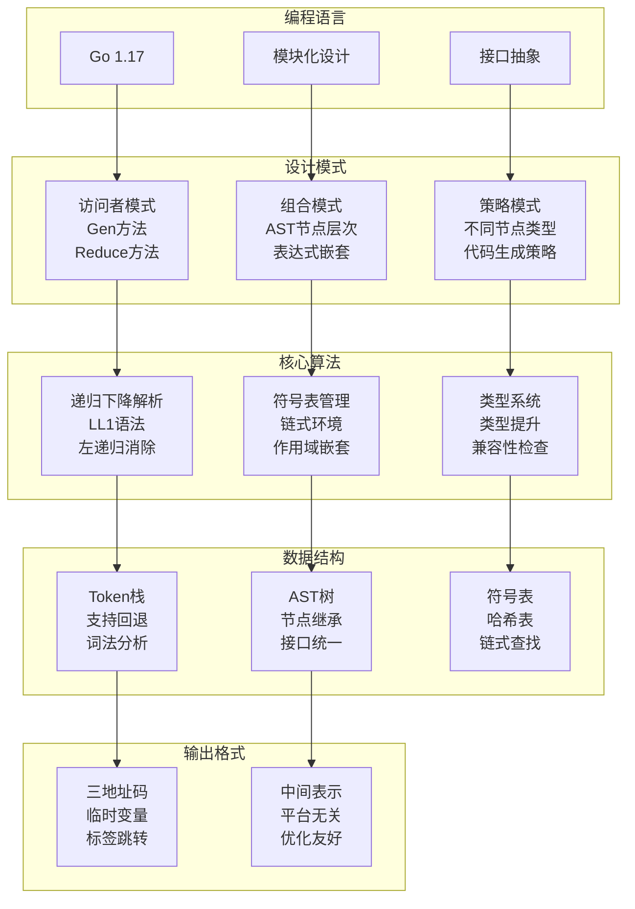

# 编译器项目架构与运行流程分析

## 项目概述

这是一个用 Go 语言实现的简化版编译器项目，主要用于编译类似 Python 语法的简单程序。该编译器采用经典的三阶段编译架构：词法分析(Lexer) → 语法分析(Parser) → 中间代码生成(Inter)。

[项目地址](https://github.com/QMEOWQ/compiler_by_golang.git)

<!-- more -->

## 📊 架构图表索引

本文档包含以下可视化图表，帮助理解项目架构：

1. **[编译器核心流程概览](#编译器核心流程概览)** - 主要编译阶段的横向流程
2. **[模块架构与数据流](#模块架构与数据流)** - 三大模块的数据传递关系
3. **[表达式处理流程](#表达式处理流程)** - 复杂表达式的分解过程
4. **[技术栈概览](#技术栈概览)** - 项目使用的技术和设计模式
5. **[发展路径概览](#发展路径概览)** - 项目的扩展和优化路线图
6. **[AST 节点继承体系](#ast-节点继承体系)** - 抽象语法树的类层次结构

## 项目结构

```
py_compiler_by_golang_willuse_after_intercode/
├── main.go                 # 程序入口
├── go.mod                  # 主模块依赖管理
├── lexer/                  # 词法分析模块
│   ├── lexer.go           # 词法分析器核心实现
│   ├── token.go           # Token定义和标记
│   ├── num_token.go       # 数值Token处理
│   ├── word_token.go      # 关键字Token处理
│   └── *_test.go          # 单元测试文件
├── parser/                 # 语法分析模块
│   ├── list_parser.go     # 递归下降解析器
│   ├── env.go             # 符号表环境管理
│   ├── symbol.go          # 符号定义
│   └── go.mod             # 模块依赖
└── inter/                  # 中间代码生成模块
    ├── inter.go           # 接口定义
    ├── node.go            # AST节点基类
    ├── expr.go            # 表达式节点
    ├── arith.go           # 算术表达式节点
    ├── id.go              # 标识符节点
    ├── constant.go        # 常量节点
    ├── temp.go            # 临时变量节点
    ├── set.go             # 赋值语句节点
    ├── stmt.go            # 语句节点基类
    ├── seq.go             # 语句序列节点
    ├── expression.go      # 表达式语句节点
    ├── type.go            # 类型系统
    └── go.mod             # 模块依赖
```

## 核心技术架构

### 1. 词法分析器 (Lexer)

**主要功能：**

- 将源代码字符流转换为 Token 流
- 识别关键字、标识符、数字、操作符等
- 支持回退机制用于语法分析

**核心组件：**

- `Lexer`结构体：维护扫描状态和 Token 栈
- `Token`系统：定义了 40+种 Token 类型
- 关键字识别：支持 int、float、if、while 等关键字

**技术特点：**

```go
type Lexer struct {
    Lexeme       string    // 当前词素
    lexemeStack  []string  // 词素栈(支持回退)
    tokenStack   []Token   // Token栈
    peek         byte      // 预读字符
    Line         uint32    // 行号追踪
    reader       *bufio.Reader
    read_pointer int       // 读取指针
    key_words    map[string]Token // 关键字表
}
```

### 2. 语法分析器 (Parser)

**主要功能：**

- 采用递归下降解析算法
- 构建抽象语法树(AST)
- 管理符号表和作用域

**语法规则：**

```
program  → block
block    → "{" decls stmts "}"
decls    → decls decl | ε
decl     → type id ";"
stmts    → stmts stmt | ε
stmt     → assign | expr ";"
assign   → id "=" expr ";"
expr     → expr "+" term | expr "-" term | term
term     → factor
factor   → num | real | id | "(" expr ")"
```

**符号表管理：**

- 使用链式环境(Env)实现作用域嵌套
- 支持变量声明和查找
- 类型检查和存储空间计算

### 3. 中间代码生成器 (Inter)

**主要功能：**

- 将 AST 转换为三地址码
- 实现类型提升和检查
- 生成临时变量和标签

**核心设计模式：**

- **访问者模式**：通过 Gen()和 Reduce()方法遍历 AST
- **组合模式**：节点层次结构支持复杂表达式
- **策略模式**：不同节点类型有不同的代码生成策略

## 运行流程详解

### 编译器核心流程概览



### 模块架构与数据流



### 表达式处理流程

```mermaid
graph LR
    A["d = x + y + c"] --> B[语法解析]
    B --> C[Set节点]
    C --> D[Arith节点<br/>x+y+c]
    D --> E[分解为<br/>Arith(x+y) + ID(c)]
    E --> F[生成临时变量<br/>t1 = x + y]
    F --> G[最终赋值<br/>d = t1 + c]

    style A fill:#ffebee
    style G fill:#e8f5e8
    style C,D,E fill:#f3e5f5
    style F fill:#fff3e0
```

## 示例运行过程

**输入代码：**

```c
{int x; float y; float c; float d;
 x = 1; y = 3.14;
 c = x + y;
 d = x + y + c;
}
```

**词法分析结果：**

```
LEFT_BRACE, BASIC(int), ID(x), SEMICOLON, BASIC(float), ID(y), ...
```

**语法分析结果：**

- 构建包含 4 个变量声明的符号表
- 生成包含 4 个赋值语句的 AST

**中间代码生成结果（实际运行输出）：**

```
L1:
        x = 1
L3:
        y = 3.14
L4:
        c = x + y
L5:
        t1 = x + y      d = t1 + c
L2:
```

**代码生成分析：**

1. `L1:` - 程序开始标签
2. `x = 1` - 直接赋值，无需临时变量
3. `L3:` - 下一条语句标签
4. `y = 3.14` - 浮点数赋值
5. `L4:` - 表达式语句标签
6. `c = x + y` - 简单二元运算，直接生成
7. `L5:` - 复杂表达式标签
8. `t1 = x + y` - 子表达式先计算并存入临时变量
9. `d = t1 + c` - 使用临时变量完成最终计算
10. `L2:` - 程序结束标签

**关键观察：**

- 编译器为每个语句生成了独立的标签
- 复杂表达式 `x + y + c` 被正确分解为两步
- 临时变量 `t1` 用于存储中间结果
- 标签生成策略确保了代码的可跳转性

### 更多测试示例

**示例 2：复杂表达式处理**

输入代码：

```c
{int a; int b; int c; int result;
 a = 10; b = 20; c = 30;
 result = a + b - c;
}
```

输出结果：

```
L1:
        a = 10
L3:
        b = 20
L4:
        c = 30
L5:
        t2 = a + b      result = t2 - c
L2:
```

**分析：**

- 临时变量编号递增（t1 → t2）
- 减法运算同样被正确处理
- 每个变量赋值都有独立的标签

## 关键技术实现

### 1. 类型系统

```go
type Type struct {
    width  uint32    // 存储字节数
    tag    lexer.Tag // 类型标记
    Lexeme string    // 类型名称
}
```

**类型提升规则：**

- int + float → float
- 自动进行数值类型转换
- 支持 bool、char、int、float 四种基本类型

### 2. 临时变量管理

```go
type Temp struct {
    expr   *Expr
    number uint32  // 临时变量编号
}
```

**生成策略：**

- 复杂表达式自动分解为临时变量
- 全局计数器确保变量名唯一
- 格式：t1, t2, t3...

### 3. 错误处理机制

- 行号追踪：所有节点记录源码行号
- 类型检查：赋值和运算时进行类型兼容性检查
- 符号表查找：未定义变量检测

## 可能出现的问题与解决方案

### 1. 内存管理问题

**问题：** Go 的垃圾回收可能影响编译性能
**解决：**

- 使用对象池复用 AST 节点
- 及时释放大型数据结构引用

### 2. 递归深度限制

**问题：** 深度嵌套表达式可能导致栈溢出
**解决：**

- 实现迭代版本的 AST 遍历
- 增加递归深度检查

### 3. 类型系统扩展性

**问题：** 当前类型系统较简单，难以支持复杂类型
**解决：**

- 重构 Type 结构支持复合类型
- 实现类型推导机制

### 4. 错误恢复能力

**问题：** 遇到语法错误时直接 panic，用户体验差
**解决：**

- 实现错误恢复机制
- 收集多个错误后统一报告

## 技术亮点

1. **模块化设计**：三个独立模块，职责清晰
2. **接口抽象**：NodeInterface、ExprInterface、StmtInterface 提供统一接口
3. **回退机制**：词法分析器支持 Token 回退，便于语法分析
4. **符号表管理**：链式环境支持作用域嵌套
5. **代码生成**：访问者模式实现 AST 遍历和代码生成

## 扩展建议

1. **优化算法**：实现更高效的语法分析算法(如 LR)
2. **功能扩展**：支持函数、数组、结构体等复杂语法
3. **目标代码生成**：添加汇编代码或字节码生成
4. **调试支持**：添加调试信息生成和运行时支持
5. **性能优化**：实现代码优化 pass(常量折叠、死代码消除等)

这个编译器项目展示了编译原理的核心概念，是学习编译技术的优秀实践案例。

## 详细技术分析

### 技术栈概览



### AST 节点继承体系



### 编译流程状态机



### 表达式求值过程

以表达式 `x + y * z` 为例：



### 符号表查找机制



## 性能分析与优化建议

### 时间复杂度分析

| 阶段       | 复杂度 | 说明                 |
| ---------- | ------ | -------------------- |
| 词法分析   | O(n)   | n 为源码字符数       |
| 语法分析   | O(n²)  | 最坏情况下的递归下降 |
| 代码生成   | O(m)   | m 为 AST 节点数      |
| 符号表查找 | O(d)   | d 为作用域嵌套深度   |

### 内存使用分析

```go
// 主要内存消耗组件
type MemoryProfile struct {
    TokenStack    []Token      // 词法分析阶段
    LexemeStack   []string     // 支持回退的词素栈
    AST_Nodes     []Node       // 语法树节点
    SymbolTables  []Env        // 符号表链
    TempVars      []Temp       // 临时变量
}
```

### 优化策略

1. **词法分析优化**

   - 使用字符串池减少内存分配
   - 实现 Token 对象池复用

2. **语法分析优化**

   - 改用表驱动的 LR 解析器
   - 实现错误恢复机制

3. **代码生成优化**
   - 实现基本块分析
   - 添加常量折叠优化
   - 死代码消除

## 测试策略

### 单元测试覆盖

```go
// 词法分析器测试
func TestTokenRecognition(t *testing.T) {
    // 测试各种Token类型识别
}

// 语法分析器测试
func TestExpressionParsing(t *testing.T) {
    // 测试表达式解析正确性
}

// 代码生成测试
func TestCodeGeneration(t *testing.T) {
    // 测试中间代码生成
}
```

### 集成测试用例

1. **基本算术表达式**
2. **变量声明和赋值**
3. **类型转换**
4. **嵌套作用域**
5. **错误处理**

## 扩展路线图

### 发展路径概览



### 短期目标 (1-2 个月)

- [ ] 添加控制流语句 (if/while)
- [ ] 实现函数定义和调用
- [ ] 完善错误处理机制

### 中期目标 (3-6 个月)

- [ ] 支持数组和指针
- [ ] 实现结构体/类
- [ ] 添加标准库支持

### 长期目标 (6 个月以上)

- [ ] 生成目标机器码
- [ ] 实现垃圾回收
- [ ] 支持并发编程
- [ ] 开发 IDE 插件

## 项目总结与评价

### 技术亮点总结

1. **架构清晰**：三层模块分离，职责明确
2. **设计模式应用**：访问者、组合、策略模式的恰当使用
3. **错误处理**：行号追踪和类型检查机制
4. **扩展性好**：接口抽象支持功能扩展
5. **实用性强**：生成标准的三地址中间代码

### 学习价值

这个项目是学习编译原理的优秀案例，涵盖了：

- **词法分析**：Token 识别、关键字处理、回退机制
- **语法分析**：递归下降、AST 构建、符号表管理
- **语义分析**：类型检查、作用域处理
- **代码生成**：中间代码、临时变量、标签管理

### 实际应用场景

1. **教学用途**：编译原理课程的实践项目
2. **原型开发**：DSL（领域特定语言）的快速原型
3. **技术研究**：编译优化算法的实验平台
4. **面试准备**：展示编译器实现能力

### 与工业级编译器的差距

| 方面     | 当前实现   | 工业级标准    | 改进建议           |
| -------- | ---------- | ------------- | ------------------ |
| 语法支持 | 基本表达式 | 完整语言特性  | 添加控制流、函数等 |
| 错误处理 | 简单 panic | 错误恢复机制  | 实现错误收集和恢复 |
| 优化能力 | 无优化     | 多层优化 pass | 添加常量折叠等优化 |
| 目标代码 | 中间代码   | 机器码/字节码 | 实现后端代码生成   |
| 调试支持 | 无         | 调试信息生成  | 添加调试符号表     |

### 推荐学习路径

1. **理解现有代码**：深入分析三个模块的实现
2. **扩展语法**：添加 if/while 等控制结构
3. **优化实现**：实现基本的编译优化
4. **后端开发**：生成目标机器码
5. **工具链集成**：开发配套的调试和分析工具

这个编译器项目不仅展示了编译原理的核心概念，更是一个可以持续演进的学习平台，适合深入研究编译技术的各个方面。通过逐步扩展和优化，可以将其发展成为功能完整的编程语言实现。

---

## 📈 图表说明

本文档中的所有架构图表均采用横向布局设计，符合现代软件架构文档的可读性要求：

- **流程图**：展示数据和控制流的传递方向
- **模块图**：突出各组件间的依赖关系
- **技术栈图**：分层展示项目的技术选型
- **路线图**：时间轴式的发展规划

这些图表可以帮助读者快速理解项目的整体架构，也可作为后续开发和扩展的参考依据。

整体架构流程图



AST 节点处理与代码生成流程

```mermaid
graph TD
    A[表达式: d = x + y + c] --> B[Parser解析]

    B --> C[AST构建]
    C --> D[Set节点<br/>左: ID(d)<br/>右: Arith(x+y+c)]

    D --> E[Arith节点分解]
    E --> F[左操作数: Arith(x+y)]
    E --> G[操作符: +]
    E --> H[右操作数: ID(c)]

    F --> I[进一步分解]
    I --> J[左: ID(x)]
    I --> K[操作符: +]
    I --> L[右: ID(y)]

    subgraph "代码生成阶段"
        M[调用Gen方法]
        N[子表达式求值]
        O[临时变量分配]
        P[中间代码输出]
    end

    D --> M
    M --> N
    N --> O
    O --> P

    P --> Q[t1 = x + y]
    P --> R[d = t1 + c]

    style A fill:#ffebee
    style D fill:#e3f2fd
    style F,H fill:#f1f8e9
    style J,L fill:#fff8e1
    style Q,R fill:#e8f5e8
```

技术栈与设计模式


