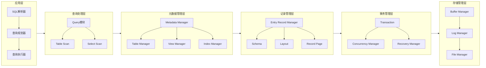
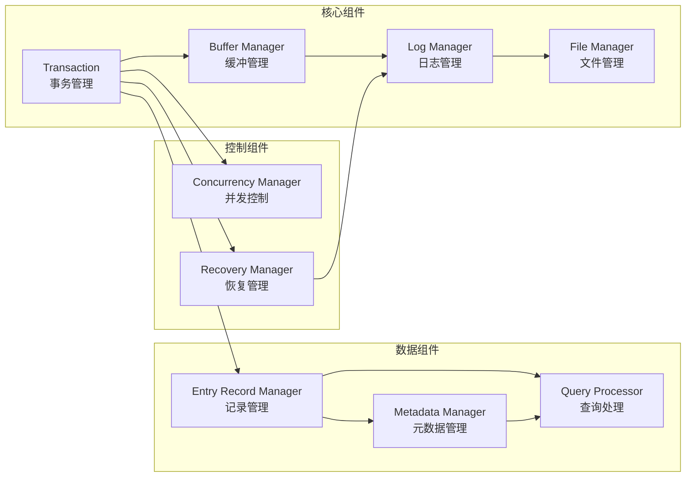
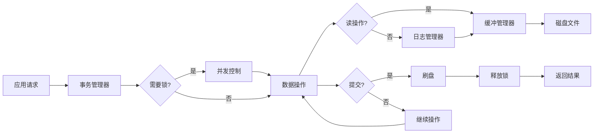
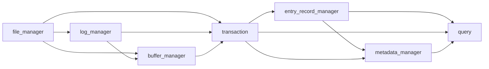
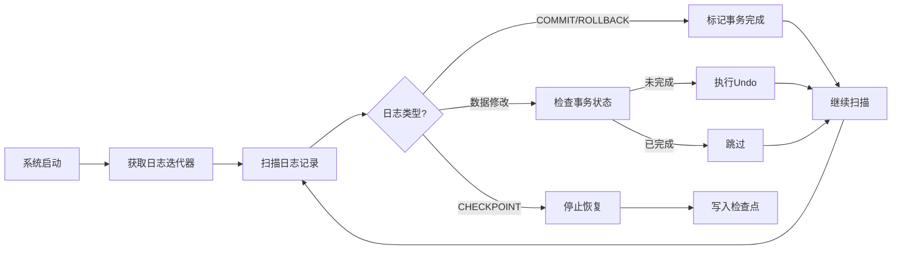
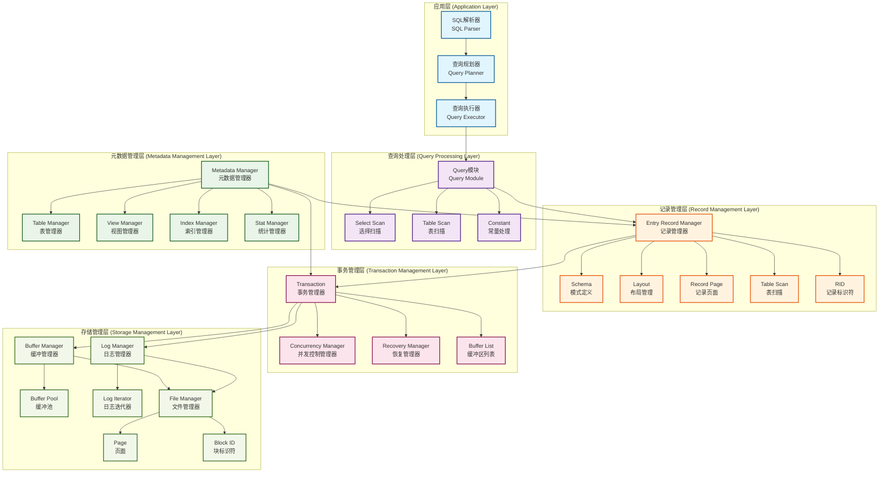
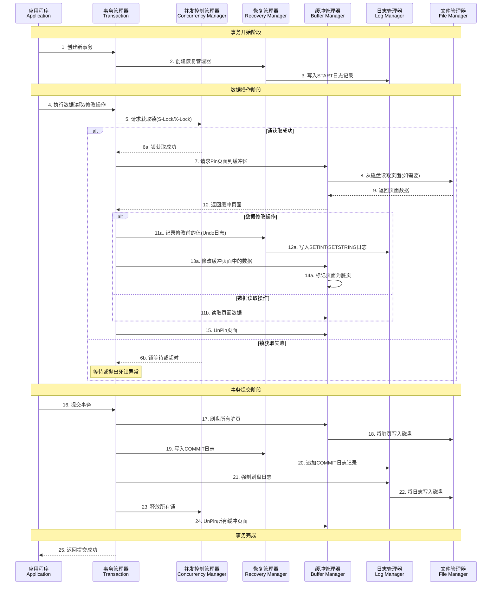
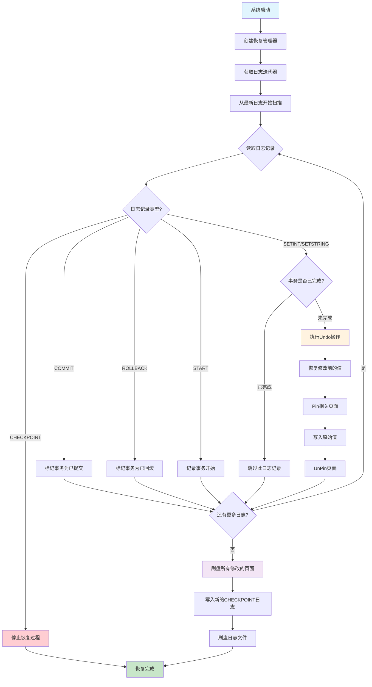

# Go 语言数据库系统架构分析文档

## 项目概述

这是一个用 Go 语言实现的关系型数据库管理系统，采用分层架构设计，实现了数据库系统的核心功能，包括存储管理、事务处理、并发控制、恢复机制、索引管理等。项目展示了数据库系统的完整实现过程和关键技术。

[项目地址](https://github.com/QMEOWQ/db_by_golang.git)

## 整体架构

> **注意**: 如果您的 markdown 查看器不支持 mermaid 图表渲染，建议使用以下工具：
>
> - **在线查看**: [Mermaid Live Editor](https://mermaid.live/)
> - **VS Code 插件**: Mermaid Preview
> - **GitHub**: 原生支持 mermaid 渲染
> - **Typora**: 支持实时 mermaid 渲染
> - **GitLab**: 原生支持 mermaid 渲染

### 分层架构图



### 核心组件交互图



### 数据流向图



### 模块依赖关系



## 核心组件详细分析

### 1. 文件管理器 (File Manager)

**职责**: 负责底层文件 I/O 操作，管理数据库文件的读写

**核心功能**:

- 块级别的文件读写操作
- 文件大小管理和扩展
- 页面(Page)数据结构的管理
- 文件映射和缓存

**关键实现**:

```go
type FileManager struct {
    db_directory string
    block_size   uint64
    open_files   map[string]*os.File
    mutex        sync.Mutex
}
```

**技术要点**:

- 使用固定大小的块(Block)进行 I/O 操作，提高效率
- 通过文件映射减少重复打开文件的开销
- 线程安全的文件操作

### 2. 日志管理器 (Log Manager)

**职责**: 实现预写日志(WAL)机制，支持事务恢复

**核心功能**:

- 日志记录的追加写入
- 日志序列号(LSN)管理
- 日志刷盘控制
- 日志迭代器支持

**关键实现**:

```go
type LogManager struct {
    file_manager   *fm.FileManager
    log_file       string
    log_page       *fm.Page
    current_blk    *fm.BlockID
    latest_lsn     uint64
    last_saved_lsn uint64
    mutex          sync.Mutex
}
```

**技术要点**:

- 从页面底部向上写入日志，确保最新日志在前
- 支持按 LSN 刷盘，保证事务持久性
- 线程安全的日志操作

### 3. 缓冲管理器 (Buffer Manager)

**职责**: 管理内存中的数据页缓存，减少磁盘 I/O

**核心功能**:

- 缓冲池管理
- 页面置换策略
- 脏页刷盘
- 引用计数管理

**关键实现**:

```go
type BufferManager struct {
    buffer_pool    []*Buffer
    num_available  uint64
    mutex          sync.Mutex
}

type Buffer struct {
    fm       *fmg.FileManager
    lm       *lmg.LogManager
    contents *fmg.Page
    blk      *fmg.BlockID
    pins     uint32  // 引用计数
    tsnum    int32   // 事务号
    lsn      uint64  // 日志序列号
}
```

**技术要点**:

- 使用引用计数(pins)控制页面生命周期
- 支持按事务号批量刷盘
- 实现缓冲池满时的等待机制

### 4. 事务管理器 (Transaction)

**职责**: 提供事务的 ACID 特性保证

**核心功能**:

- 事务生命周期管理
- 并发控制
- 恢复管理
- 缓冲区管理

**关键实现**:

```go
type Transaction struct {
    concurr_manager  *ConCurrencyManager
    recovery_manager *RecoveryManager
    file_manager     *fm.FileManager
    log_manager      *lm.LogManager
    buffer_manager   *bm.BufferManager
    buffers          *BufferList
    ts_num           int32
}
```

**技术要点**:

- 集成并发控制和恢复管理
- 自动事务号分配
- 支持事务提交、回滚和恢复

### 5. 并发控制管理器 (Concurrency Manager)

**职责**: 实现基于锁的并发控制机制

**核心功能**:

- 共享锁(S-Lock)和排他锁(X-Lock)
- 死锁检测和超时处理
- 锁升级和降级
- 锁表管理

**关键实现**:

```go
type ConCurrencyManager struct {
    lock_table *LockTable
    lock_map   map[fm.BlockID]string
}

type LockTable struct {
    lock_map     map[*fm.BlockID]int64
    method_lock  sync.Mutex
    notify_map   map[*fm.BlockID]*sync.Cond
}
```

**技术要点**:

- 基于块级别的锁机制
- 使用条件变量实现锁等待
- 超时机制防止死锁

### 6. 恢复管理器 (Recovery Manager)

**职责**: 实现基于日志的恢复机制

**核心功能**:

- 多种日志记录类型支持
- Undo 操作实现
- 检查点机制
- 系统恢复

**日志记录类型**:

- START: 事务开始
- COMMIT: 事务提交
- ROLLBACK: 事务回滚
- SETINT/SETSTRING: 数据修改
- CHECKPOINT: 检查点

**技术要点**:

- 实现 Undo 日志恢复算法
- 支持系统崩溃后的自动恢复
- 检查点优化恢复性能

### 7. 记录管理器 (Entry Record Manager)

**职责**: 管理表中记录的存储和访问

**核心组件**:

- **Schema**: 定义表结构
- **Layout**: 计算字段偏移量
- **Record Page**: 管理页面中的记录
- **Table Scan**: 提供记录遍历接口
- **RID**: 记录标识符

**关键实现**:

```go
type Schema struct {
    fields []string
    info   map[string]*FieldInfo
}

type Layout struct {
    schema    SchemaInterface
    offsets   map[string]int
    slot_size int
}
```

**技术要点**:

- 支持定长记录存储
- 使用槽位(Slot)管理记录
- 标志位标识记录状态

### 8. 元数据管理器 (Metadata Manager)

**职责**: 管理数据库的元数据信息

**核心组件**:

- **Table Manager**: 表元数据管理
- **View Manager**: 视图管理
- **Index Manager**: 索引元数据管理
- **Stat Manager**: 统计信息管理

**技术要点**:

- 使用系统表存储元数据
- 支持表、视图、索引的创建和查询
- 维护统计信息用于查询优化

### 9. 查询处理器 (Query)

**职责**: 处理查询操作

**核心组件**:

- **Table Scan**: 表扫描操作
- **Select Scan**: 选择操作
- **Constant**: 常量处理

**技术要点**:

- 实现迭代器模式
- 支持基本的关系操作
- 与索引集成提高查询性能

### 10. 索引管理器 (Index Manager)

**职责**: 提供索引功能

**实现方式**:

- 哈希索引(Hash Index)
- 使用 1000 个桶进行哈希分布
- 支持等值查询优化

## 数据流和运行流程

### 1. 系统启动流程


### 2. 事务执行流程


### 3. 查询执行流程


### 4. 恢复流程



## 关键技术和方法

### 1. 预写日志(WAL)技术

**实现原理**:

- 所有数据修改前必须先写日志
- 日志记录包含足够的信息用于 Undo 操作
- 使用 LSN 确保日志顺序

**优势**:

- 保证事务的持久性和原子性
- 支持系统崩溃后的恢复
- 减少同步 I/O 操作

### 2. 基于锁的并发控制

**实现机制**:

- 两阶段锁协议(2PL)
- 共享锁和排他锁
- 死锁检测和超时处理

**特点**:

- 保证事务的隔离性
- 支持多种隔离级别
- 防止数据竞争

### 3. 缓冲池管理

**策略**:

- 引用计数管理页面生命周期
- 按需加载和延迟写入
- LRU 替换策略

**优化**:

- 减少磁盘 I/O 次数
- 提高数据访问性能
- 支持大数据量处理

### 4. 分层架构设计

**优势**:

- 模块化设计，易于维护
- 清晰的职责分离
- 支持功能扩展

**特点**:

- 每层只依赖下层接口
- 高内聚低耦合
- 便于测试和调试

### 5. 接口驱动开发

**实现方式**:

- 定义清晰的接口规范
- 面向接口编程
- 支持多种实现

**好处**:

- 提高代码可测试性
- 支持功能替换和扩展
- 降低模块间耦合

## 潜在问题和改进建议

### 1. 性能问题

**当前限制**:

- 缓冲池大小固定，可能成为瓶颈
- 锁粒度较粗(块级别)，并发度有限
- 缺乏查询优化器

**改进建议**:

- 实现动态缓冲池大小调整
- 支持行级锁或更细粒度的锁
- 添加基于成本的查询优化器
- 实现索引优化和统计信息收集

### 2. 可扩展性问题

**当前限制**:

- 单机架构，无法水平扩展
- 存储容量受单机限制
- 无分布式事务支持

**改进建议**:

- 实现分片(Sharding)机制
- 支持分布式事务
- 添加副本和容错机制

### 3. 功能完整性

**缺失功能**:

- SQL 解析器和优化器
- 复杂查询支持(JOIN、聚合等)
- 用户权限管理
- 备份和恢复工具

**改进建议**:

- 实现完整的 SQL 支持
- 添加查询优化功能
- 实现用户认证和授权
- 提供管理工具

### 4. 错误处理

**当前问题**:

- 部分错误处理不够完善
- 缺乏详细的错误信息
- 异常恢复机制有限

**改进建议**:

- 完善错误处理机制
- 添加详细的日志记录
- 实现更 robust 的异常恢复

### 5. 测试覆盖

**当前状态**:

- 基本功能测试较完善
- 缺乏压力测试和边界测试
- 并发测试有限

**改进建议**:

- 增加压力测试和性能测试
- 完善并发场景测试
- 添加集成测试和端到端测试

## 技术亮点

### 1. 完整的事务 ACID 实现

- 原子性: 通过 Undo 日志实现
- 一致性: 通过约束检查保证
- 隔离性: 通过锁机制实现
- 持久性: 通过 WAL 机制保证

### 2. 模块化设计

- 清晰的分层架构
- 良好的接口设计
- 高度的代码复用

### 3. 并发安全

- 线程安全的核心组件
- 死锁检测和处理
- 资源竞争控制

### 4. 恢复机制

- 基于日志的恢复算法
- 检查点优化
- 系统崩溃恢复

## 学习价值

这个项目展示了数据库系统的核心概念和实现技术，对于理解数据库内部机制具有很高的学习价值：

1. **存储管理**: 了解页面、块、缓冲池等概念
2. **事务处理**: 学习 ACID 特性的实现原理
3. **并发控制**: 掌握锁机制和死锁处理
4. **恢复机制**: 理解 WAL 和恢复算法
5. **系统设计**: 学习分层架构和模块化设计

## 实现顺序和开发建议

根据 README 中的实现顺序，项目采用了自底向上的开发方式：

```
1. recovery_mgr ->
2. concurr_mgr ->
3. entry_record_mgr ->
4. view_mgr ->
5. sql_lexer ->
6. parser ->
7. select_parser ->
8. create_parser ->
9. insert_delete_update_parser ->
10. planner ->
11. hash_index
```

这种顺序体现了数据库系统的依赖关系，先实现底层的存储和事务机制，再构建上层的查询处理功能。

## 总结

这是一个设计良好的数据库系统实现，虽然功能相对简单，但核心机制完整，代码结构清晰，是学习数据库系统原理的优秀案例。通过分析这个项目，可以深入理解数据库系统的内部工作原理和关键技术实现。

项目的主要价值在于：

- 展示了完整的数据库系统架构
- 实现了核心的 ACID 事务特性
- 提供了清晰的模块化设计范例
- 包含了丰富的测试用例
- 适合作为数据库系统学习的参考实现

整体架构图



事务执行流程图



系统恢复流程图


