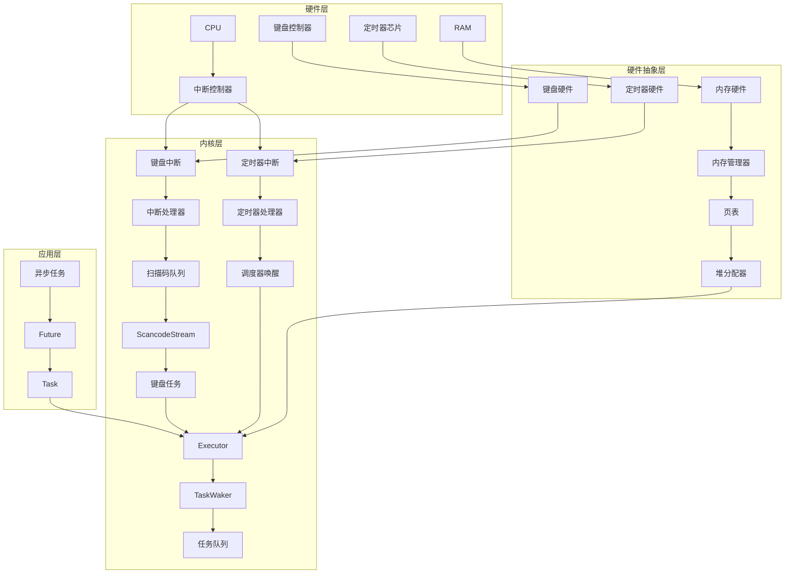
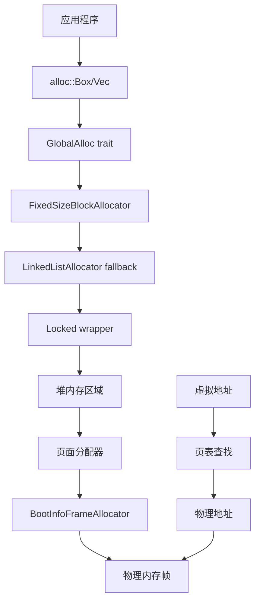
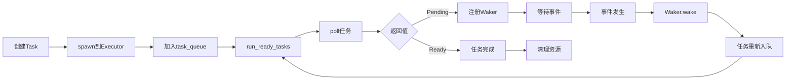
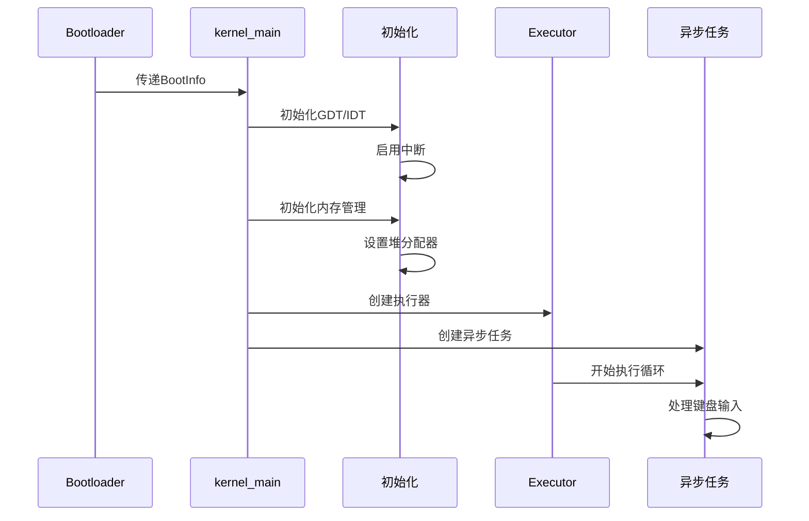
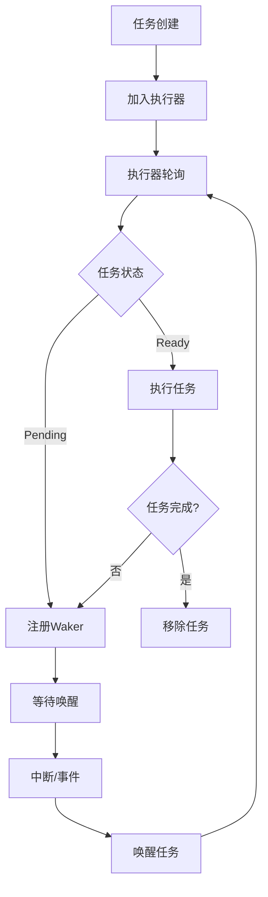
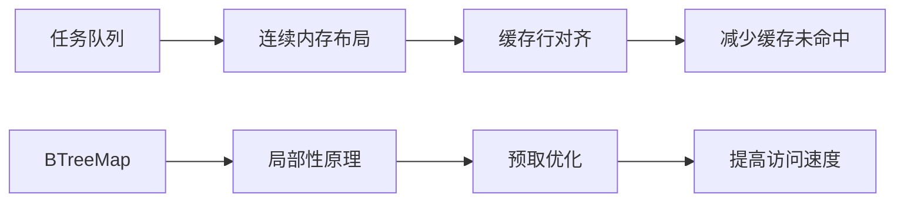
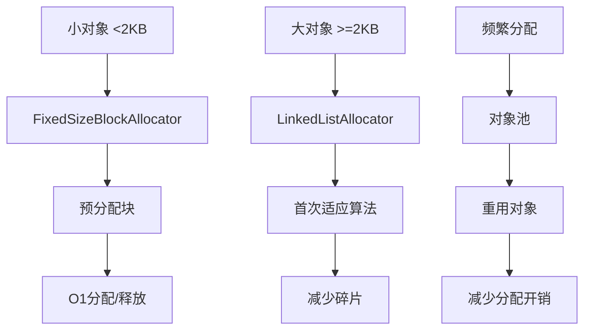
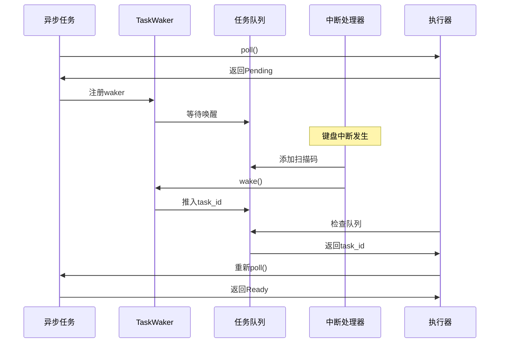

# OS by Rust - 项目架构文档

## 项目概述

这是一个用 Rust 语言编写的操作系统内核，展示了现代系统编程的核心概念，特别是异步编程在操作系统中的应用。

[项目地址](https://github.com/QMEOWQ/os_kernel_by_rust.git)

## 核心特性

- ✅ **内存管理**: 分页机制、物理内存分配、堆内存管理
- ✅ **中断处理**: 键盘中断、定时器中断、异常处理
- ✅ **异步任务系统**: 基于 Future 的协作式多任务
- ✅ **设备驱动**: VGA 文本输出、串口通信、键盘输入
- ✅ **安全性**: 利用 Rust 的类型系统保证内存安全

## 项目结构

```
os_by_rust_after_async_await/
├── src/
│   ├── main.rs              # 内核入口点
│   ├── lib.rs               # 库根模块
│   ├── allocator/           # 堆内存分配器
│   │   ├── mod.rs
│   │   ├── bump.rs          # 简单的bump分配器
│   │   ├── linked_list.rs   # 链表分配器
│   │   └── fixed_size_block.rs # 固定大小块分配器
│   ├── task/                # 异步任务系统
│   │   ├── mod.rs           # 任务抽象和ID生成
│   │   ├── executor.rs      # 高效的任务执行器
│   │   ├── simple_executor.rs # 简单的轮询执行器
│   │   └── keyboard.rs      # 键盘输入异步处理
│   ├── memory.rs            # 内存管理
│   ├── interrupts.rs        # 中断处理
│   ├── gdt.rs               # 全局描述符表
│   ├── vga_buffer.rs        # VGA文本输出
│   └── serial.rs            # 串口通信
├── tests/                   # 集成测试
├── async_test/              # 异步功能独立测试
└── Cargo.toml               # 项目配置
```

## 系统架构图

### 整体架构



### 内存管理架构



### 异步任务调度流程



## 核心模块详解

### 1. 异步任务系统 (`src/task/`)

#### 设计理念

采用协作式多任务模型，基于 Rust 的 Future trait 实现异步编程。

#### 核心组件

**Task (任务抽象)**

```rust
pub struct Task {
    pub id: TaskId,
    future: Pin<Box<dyn Future<Output = ()>>>,
}
```

**Executor (执行器)**

- 维护任务队列和唤醒缓存
- 实现高效的任务调度
- 支持 CPU 休眠以节省电力

**TaskWaker (唤醒器)**

- 实现 Wake trait
- 将任务 ID 推入队列进行重新调度
- 避免不必要的轮询

#### 执行流程

1. 任务被 spawn 到执行器
2. 执行器轮询就绪任务
3. 任务返回 Pending 时注册 waker
4. 中断或事件触发时唤醒相关任务
5. 任务重新进入就绪队列

### 2. 内存管理 (`src/memory.rs`, `src/allocator/`)

#### 分层架构

```
应用层分配 (Box, Vec, etc.)
        ↓
全局分配器 (GlobalAlloc)
        ↓
堆分配器 (FixedSizeBlockAllocator)
        ↓
页面分配器 (BootInfoFrameAllocator)
        ↓
物理内存
```

#### 分配策略

- **固定大小块分配器**: 用于小对象分配，减少碎片
- **链表分配器**: 用于大对象分配
- **Bump 分配器**: 简单的线性分配器（仅用于测试）

### 3. 中断处理 (`src/interrupts.rs`)

#### 中断向量表

```rust
lazy_static! {
    static ref IDT: InterruptDescriptorTable = {
        let mut idt = InterruptDescriptorTable::new();
        idt.breakpoint.set_handler_fn(breakpoint_handler);
        idt.double_fault.set_handler_fn(double_fault_handler);
        idt[InterruptIndex::Timer.as_usize()]
            .set_handler_fn(timer_interrupt_handler);
        idt[InterruptIndex::Keyboard.as_usize()]
            .set_handler_fn(keyboard_interrupt_handler);
        idt.page_fault.set_handler_fn(page_fault_handler);
        idt
    };
}
```

#### 键盘中断处理流程

1. 硬件产生键盘中断
2. CPU 调用键盘中断处理器
3. 读取扫描码并推入队列
4. 唤醒键盘任务
5. 异步处理键盘输入

## 运行流程

### 启动序列



### 异步任务执行流程



## 技术特点与创新

### 1. 零成本抽象

- **编译时优化**: Rust 编译器在编译时进行大量优化，消除抽象层的运行时开销
- **内联展开**: 小函数和闭包在编译时被内联，避免函数调用开销
- **单态化**: 泛型代码为每个具体类型生成专门的代码，提高性能
- **RAII**: 资源获取即初始化，自动管理资源生命周期

### 2. 异步编程模型

- **协作式多任务**: 任务主动让出控制权，避免抢占式调度的开销
- **状态机转换**: async/await 语法糖编译为高效的状态机
- **零分配**: Future 在栈上分配，避免堆分配开销
- **组合性**: 可以轻松组合多个异步操作

### 3. 内存安全保证

- **所有权系统**: 编译时跟踪内存所有权，防止 use-after-free
- **借用检查**: 确保引用的有效性，防止悬垂指针
- **生命周期**: 编译时验证引用的生命周期，确保内存安全
- **类型安全**: 强类型系统防止类型混淆和缓冲区溢出

### 4. 并发安全

- **Send/Sync trait**: 编译时检查类型的线程安全性
- **原子操作**: 使用原子类型进行无锁编程
- **通道通信**: 通过消息传递而非共享内存进行通信
- **锁自动释放**: RAII 确保锁的正确释放

### 5. 性能优化技术

#### CPU 缓存友好设计



#### 内存分配策略



#### 中断处理优化

- **最小化中断禁用时间**: 只在关键区域禁用中断
- **中断处理分离**: 将耗时操作推迟到任务中执行
- **批量处理**: 一次处理多个中断事件
- **优先级调度**: 高优先级中断优先处理

## 关键技术深度解析

### 异步状态机原理

当编译器遇到 async 函数时，会将其转换为实现 Future trait 的状态机：

```rust
// 原始async函数
async fn example_task() {
    let num = async_number().await;
    println!("async number is: {}", num);
}

// 编译器生成的状态机（简化版）
enum ExampleTaskState {
    Start,
    WaitingForNumber { future: AsyncNumberFuture },
    Done,
}

impl Future for ExampleTask {
    type Output = ();

    fn poll(mut self: Pin<&mut Self>, cx: &mut Context<'_>) -> Poll<()> {
        loop {
            match self.state {
                Start => {
                    self.state = WaitingForNumber {
                        future: async_number()
                    };
                }
                WaitingForNumber { ref mut future } => {
                    match Pin::new(future).poll(cx) {
                        Poll::Ready(num) => {
                            println!("async number is: {}", num);
                            self.state = Done;
                        }
                        Poll::Pending => return Poll::Pending,
                    }
                }
                Done => return Poll::Ready(()),
            }
        }
    }
}
```

### 唤醒机制详解



## 潜在问题与解决方案

### 1. 栈溢出问题

**问题**: 深度递归可能导致栈溢出
**解决方案**:

- 使用独立的中断栈 (IST)
- 实现栈保护机制
- 限制递归深度

### 2. 中断延迟

**问题**: 长时间运行的任务可能延迟中断处理
**解决方案**:

- 实现抢占式调度
- 设置任务执行时间限制
- 优化中断处理器性能

### 3. 内存碎片

**问题**: 频繁分配/释放导致内存碎片
**解决方案**:

- 使用多种分配策略
- 实现内存压缩
- 采用对象池模式

### 4. 死锁风险

**问题**: 多个锁的获取顺序可能导致死锁
**解决方案**:

- 统一锁获取顺序
- 使用无锁数据结构
- 实现死锁检测

## 性能优化

### 1. 任务调度优化

- 使用优先级队列
- 实现工作窃取算法
- 减少上下文切换

### 2. 内存管理优化

- 预分配常用大小的内存块
- 实现内存池
- 使用 NUMA 感知分配

### 3. 中断处理优化

- 最小化中断处理时间
- 使用中断线程化
- 实现中断合并

## 扩展方向

### 1. 网络栈

- 实现 TCP/IP 协议栈
- 支持异步网络 I/O
- 添加网络设备驱动

### 2. 文件系统

- 实现基本文件系统
- 支持异步文件操作
- 添加存储设备驱动

### 3. 进程管理

- 实现用户态进程
- 支持进程间通信
- 添加系统调用接口

### 4. 图形界面

- 实现基本 GUI 框架
- 支持窗口管理
- 添加图形设备驱动

## 测试策略

### 1. 单元测试

- 测试各个模块的核心功能
- 验证边界条件处理
- 确保错误处理正确

### 2. 集成测试

- 测试模块间交互
- 验证系统整体行为
- 测试异常情况处理

### 3. 性能测试

- 测量任务调度延迟
- 评估内存分配性能
- 分析中断处理时间

## 总结

这个项目成功展示了如何使用 Rust 构建一个现代化的操作系统内核，特别是异步编程在系统级编程中的应用。通过合理的架构设计和 Rust 的类型系统，我们实现了一个安全、高效、可扩展的操作系统基础框架。

项目的核心价值在于：

1. **教育意义**: 展示现代操作系统的核心概念
2. **技术创新**: 将异步编程引入操作系统内核
3. **安全性**: 利用 Rust 的类型系统保证内存安全
4. **可扩展性**: 模块化设计便于功能扩展
