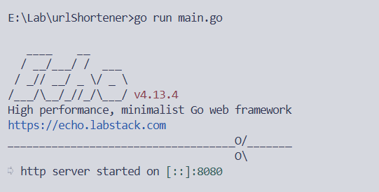
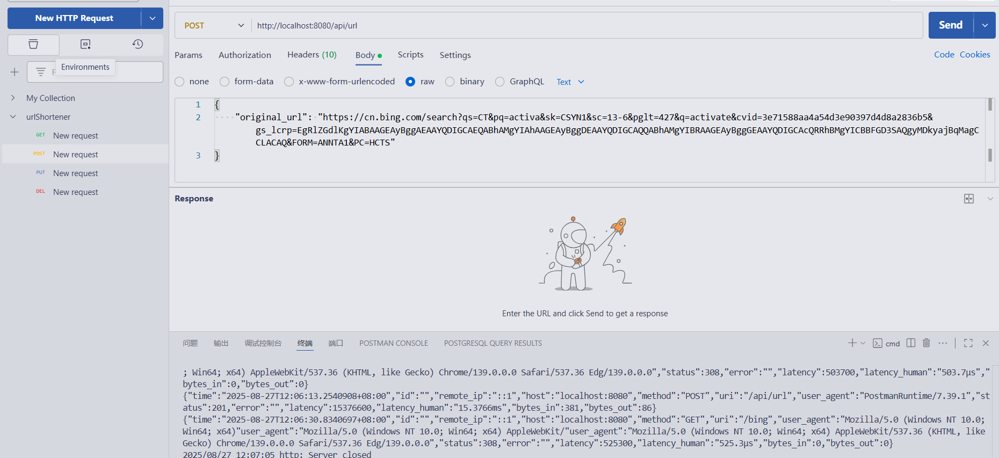
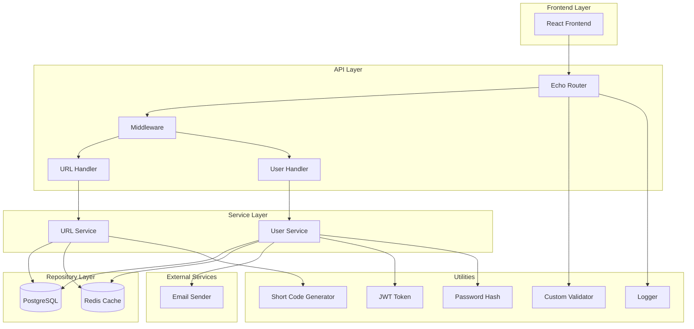
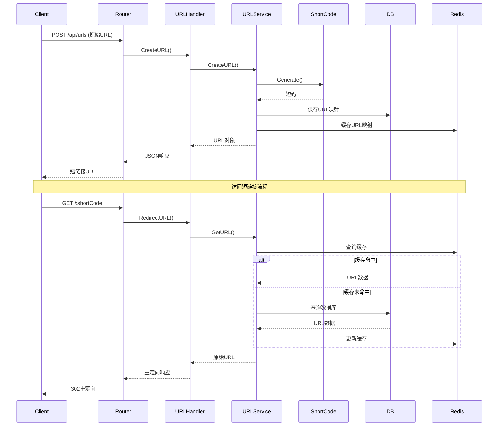
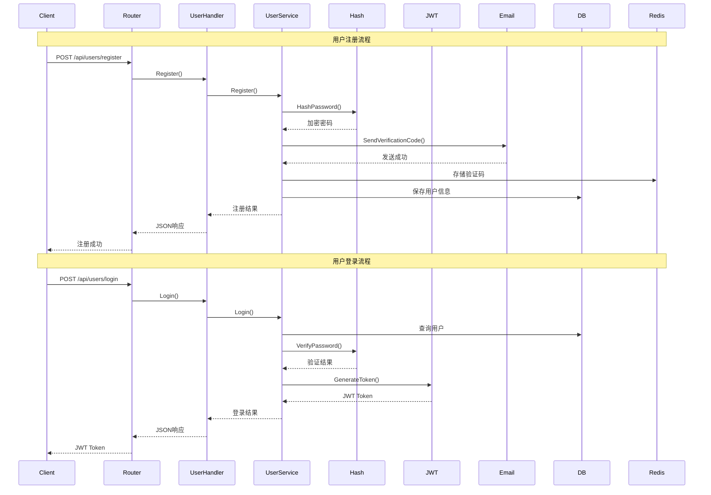
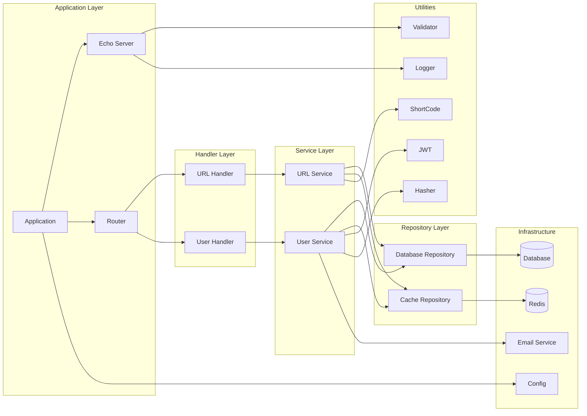
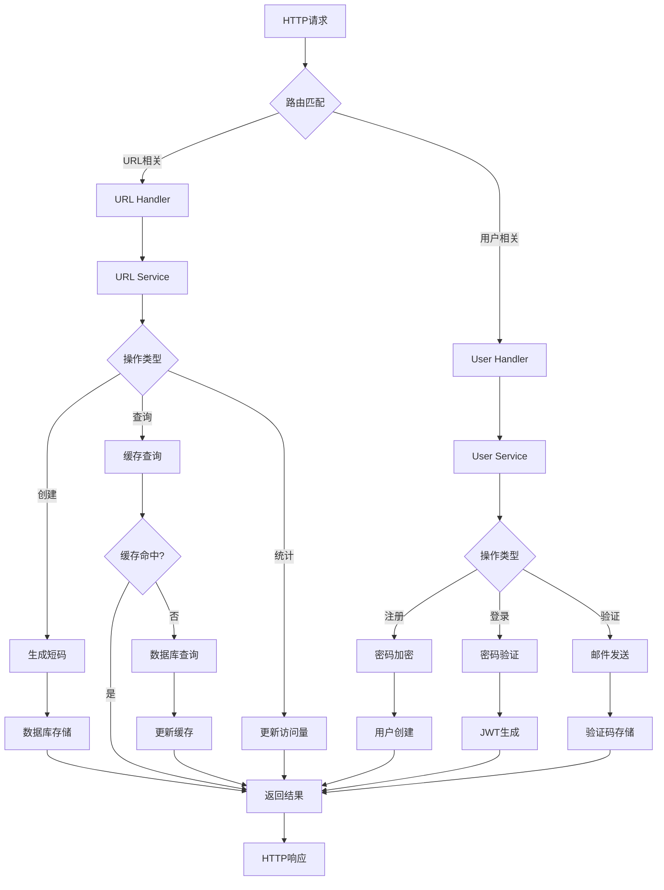
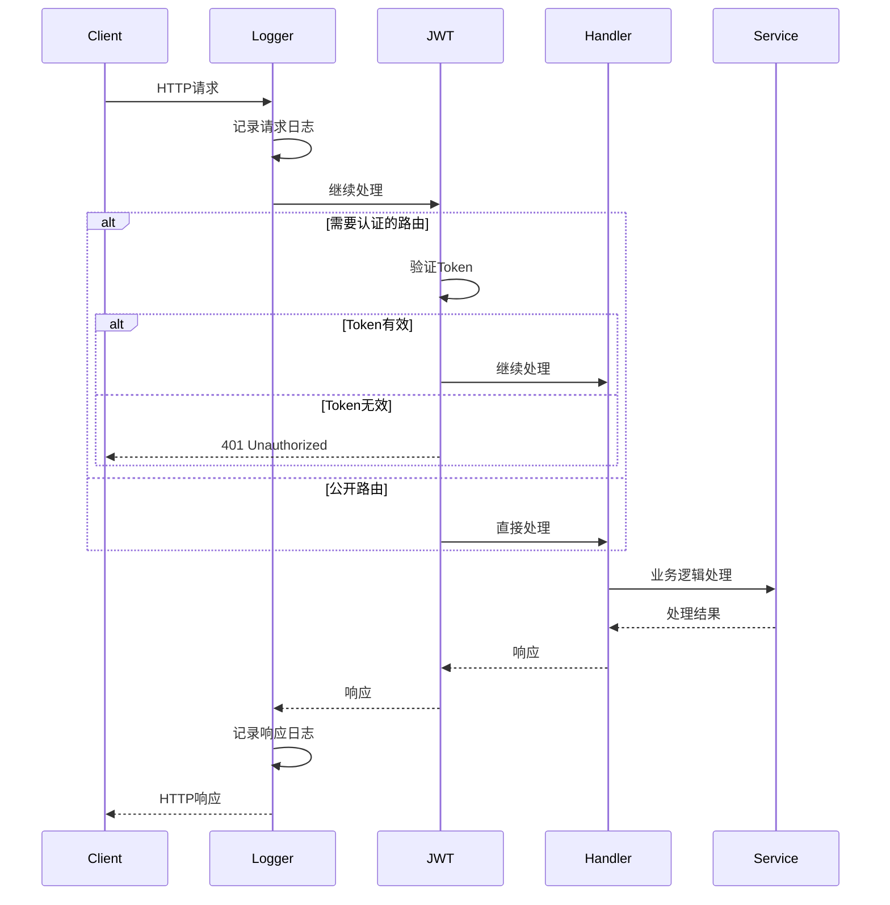

# 短链接系统

## 开发工具

### 1. 数据库迁移工具 - golang-migrate

用于数据库版本管理和迁移

```bash
go install -tags postgres github.com/golang-migrate/migrate/v4/cmd/migrate@latest
```

### 2. SQL 转 Go 代码工具 - sqlc

将 SQL 语句转换为类型安全的 Go 代码

```bash
go install github.com/sqlc-dev/sqlc/cmd/sqlc@latest
```

## 数据库环境

### 3. PostgreSQL 数据库（使用 Docker）

主数据库，用于存储短链接数据

```bash
docker run --name postgres-url \
  -e POSTGRES_USER=urltest \
  -e POSTGRES_PASSWORD=password \
  -e POSTGRES_DB=urldb \
  -p 5432:5432 \
  -d postgres

若本地已安装postgresql,请将端口映射改为
-p 5433:5432（总之不要用5432端口）
```

**连接信息：**

- 主机：localhost
- 端口：5432
- 用户名：urltest
- 密码：password
- 数据库名：urldb

### 4. Redis 缓存（使用 Docker）

用于缓存和提高性能

```bash
docker run --name redis \
  -p 6379:6379 \
  -d redis
```

**连接信息：**

- 主机：localhost
- 端口：6379

## 系统要求

### 基础环境

- **Go 版本**：1.19 或更高版本
- **Docker**：用于运行数据库和缓存服务
- **Git**：版本控制

### 开发工具推荐

- **IDE**：VS Code、GoLand 或其他支持 Go 的编辑器
- **API 测试工具**：Postman、curl 或类似工具

## 快速启动

### 1. 安装开发工具

```bash
# 安装数据库迁移工具
go install -tags postgres github.com/golang-migrate/migrate/v4/cmd/migrate@latest

# 安装SQL代码生成工具
go install github.com/sqlc-dev/sqlc/cmd/sqlc@latest
```

### 2. 启动数据库服务

```bash
# 启动PostgreSQL
docker run --name postgres-url \
  -e POSTGRES_USER=lang \
  -e POSTGRES_PASSWORD=password \
  -e POSTGRES_DB=urldb \
  -p 5432:5432 \
  -d postgres

# 启动Redis
docker run --name redis \
  -p 6379:6379 \
  -d redis
```

### 3. 验证环境

```bash
# 检查PostgreSQL连接
docker exec -it postgres-url psql -U lang -d urldb -c "SELECT version();"

# 检查Redis连接
docker exec -it redis redis-cli ping
```

## 注意事项

1. **端口占用**：确保 5432（PostgreSQL）和 6379（Redis）端口未被占用
2. **Docker 权限**：确保 Docker 服务正在运行且有足够权限
3. **网络连接**：首次运行时需要下载 Docker 镜像，确保网络连接正常
4. **数据持久化**：以上命令未配置数据持久化，重启容器后数据会丢失。生产环境请配置数据卷

## 故障排除

### 常见问题

1. **端口被占用**：使用`netstat -an | grep :5432`检查端口占用情况
2. **Docker 容器启动失败**：检查 Docker 服务状态和日志
3. **数据库连接失败**：确认容器正在运行且端口映射正确

### 有用的命令

```bash
# 查看运行中的容器
docker ps

# 查看容器日志
docker logs postgres-url
docker logs redis

# 停止容器
docker stop postgres-url redis

# 删除容器
docker rm postgres-url redis
```

sqlc 所需命令及流程

```
启动 redis, postgres 容器后，运行

migrate create -ext=sql -dir=./database/migrate -seq init_schema

make migrate_up

sqlc init

设置sqlc.yaml 后 sqlc generate在 repo文件夹下

```

运行项目：

后端：

```
docker 启动对应postgres,redis 容器
go run main.go
```



测试：

```
选用 vscode 中的 `postman` 和 `postgresql` 插件进行测试

【注】：Headers 中 Content-Type 默认设置为 text/plain, 这会导致 send 请求失败，需要设置为 application/json
```



结构图：

系统架构图：



url 短链接核心流程：



用户认证流程



组件依赖关系图：



数据流图：



中间件执行过程：


