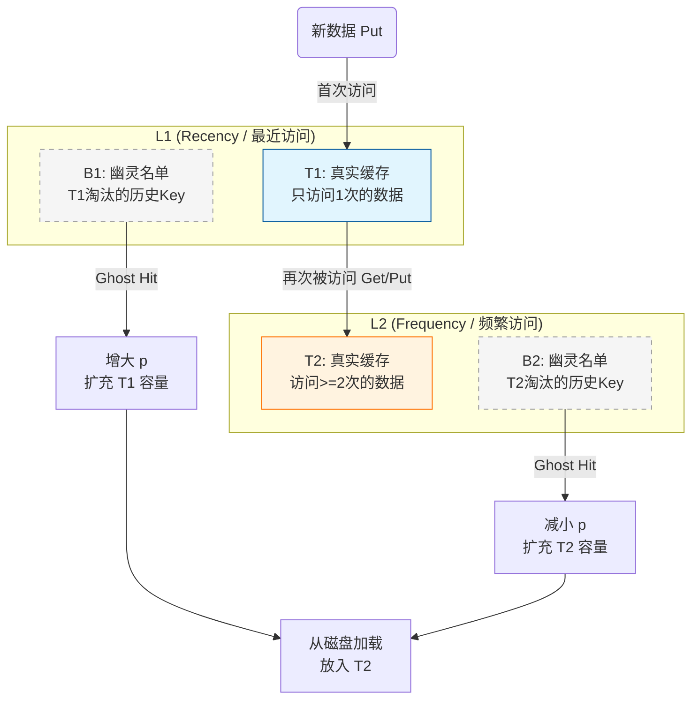

## BMCacheSystem

高性能 C++ 缓存库，支持 LRU、LRU-K、LFU、ARC 及分片。

**快速运行：**

```bash
cd BMCacheSystem && mkdir -p build && cd build
cmake .. && make
./BMCacheSystem          # 功能测试
./PerformanceTest         # 性能测试（多种子）
./PerformanceTest --quick # 性能测试（快速）
```

---

### Lru Cache

```
Map Iterator (it)
    |
    |-- first  (Key)
    |
    +-- second (NodePtr) ----> [ Node 结构体 ]
                                 |-- key
                                 |-- value  <----这就是 it->second->value
                                 |-- next
                                 |-- prev
```

为什么需要 shared_ptr？

NodePtr 使用 shared_ptr 代表 “强引用” (Ownership)。
只要有一个 shared_ptr 指向一个对象，这个对象就不会被回收。
Map 持有 shared_ptr，链表里的 next 也是 shared_ptr。这保证了只要节点还在 Map 里或者还在链表的前驱节点指向它，它就是活着的。

为什么要引入 weak_ptr？

为了解决“循环引用” (Circular Reference) 导致的内存泄漏。
想象一下，如果 prev 和 next 都是 shared_ptr：
节点 A 的 next 指向 B (A 抓着 B)。
节点 B 的 prev 指向 A (B 抓着 A)。
即使你把 Map 清空了，A 和 B 的引用计数永远由对方维持为 1。
结果：这两个节点永远不会被析构，内存泄漏

ARC (Adaptive Replacement Cache) 被公认为性能优于 LRU，甚至在很多场景下优于 LFU，因为它结合了两者的优点并能抵抗“扫描”操作带来的缓存污染。

`KArcCache` 等采用了**组合模式**：将 ARC 拆分为“LRU 部分”和“LFU 部分”，通过动态调整这两部分的容量（Capacity）来实现自适应。这是一种工程上的近似实现，虽然逻辑上拆解得比较散，但核心思想是符合 ARC 原理的。

---

### 第一部分：ARC 核心原理

#### 1. 四个核心链表

ARC 的核心在于它维护了 **4 个链表**（不仅仅是 2 个），并将它们分为两个维度：**Recency (最近)** 和 **Frequency (频繁)**。

假设总缓存容量为 **$c$**。

- **T1 (Recent Real)**:
  - 存放**只被访问过 1 次**的热数据。
  - 本质上这就是一个 LRU 列表。
  - 数据在内存中（存 Value）。
- **B1 (Recent Ghost)**:
  - **幽灵列表 (Ghost List)**。存放**从 T1 淘汰出来的 Key**（不存 Value，只存元数据）。
  - 如果数据命中 B1，说明“**最近访问过的数据又被访问了，且当初 T1 给的空间太小了**”。
  - **对策**：增大 T1 的目标容量 $p$。
- **T2 (Frequent Real)**:
  - 存放**被访问过 2 次及以上**的热数据。
  - 本质上这是一个 LFU/LRU-K 列表。
  - 数据在内存中（存 Value）。
- **B2 (Frequent Ghost)**:
  - **幽灵列表**。存放**从 T2 淘汰出来的 Key**。
  - 如果数据命中 B2，说明“**频繁访问的数据被淘汰了，LFU 空间太小了**”。
  - **对策**：减小 T1 的目标容量 $p$（相当于增大 T2 的空间）。

#### 2. 核心参数 $p$ (Partition)

ARC 的关键在于参数 **$p$**。

- $p$ 代表 **T1 的目标容量**。
- $c - p$ 代表 **T2 的目标容量**。
- $p$ 是动态变化的。系统根据 B1 和 B2 的命中情况，像推拉门一样左右移动 $p$。

#### 3. 数据流转逻辑

1.  **新数据到来**：放入 T1 头部（算作最近访问）。
2.  **T1 再次被访问**：晋升到 T2（算作频繁访问）。
3.  **T2 再次被访问**：移到 T2 头部（保持热度）。
4.  **淘汰**：
    - 如果 T1 太大（$> p$），淘汰 T1 尾部到 B1。
    - 如果 T1 不大但总缓存满了，淘汰 T2 尾部到 B2。

---

### 第二部分：结构图解 (Mermaid)

这是 ARC 的逻辑结构图。可以清晰地看到 $p$ 指针如何划分 LRU (T1) 和 LFU (T2) 的领地，以及幽灵列表的作用。



**代码的映射分析：**

- 代码中的 `ArcLruPart` 对应图中的 **L1 (T1 + B1)**。
- 代码中的 `ArcLfuPart` 对应图中的 **L2 (T2 + B2)**。
- 代码中的 `transformThreshold` 通常 ARC 算法里固定为 1（即访问第2次就进 T2），但代码里做成了可配置，增强了灵活性。

---

### 第三部分：代码实现构思 (Plan)

#### 1. 文件结构

```text
include/policy/
└── ArcCache.h  # 包含所有逻辑，不再拆分 Part
```

#### 2. 数据结构设计

需要一个通用的 `Node`，以及 4 个 `std::list`。

```cpp
// 伪代码构思
template <typename Key, typename Value>
class ArcCache : public CachePolicy<Key, Value> {
    struct Node {
        Key key;
        Value value;
        bool is_ghost; // 标记是否在幽灵表
        // ...
    };

    // 4个核心链表
    std::list<NodePtr> t1_; // L1 真实
    std::list<NodePtr> b1_; // L1 幽灵
    std::list<NodePtr> t2_; // L2 真实
    std::list<NodePtr> b2_; // L2 幽灵

    // 统一的哈希索引，指向上述任意链表中的节点
    std::unordered_map<Key, NodePtr> map_;

    size_t c_; // 总容量
    double p_; // 核心参数：T1 的目标容量 (0 ~ c)
};
```

#### 3. 核心逻辑流程 (`put` / `get`)

实现时的伪代码逻辑，基于标准 ARC：

**Get(key):**

1.  如果在 **T1** 或 **T2**:
    - 命中！
    - 将节点移动到 **T2** 头部（MRU）。
    - 返回 Value。
2.  如果在 **B1** (Ghost Hit):
    - **调整 P**: `p = min(c, p + max(1, |B2| / |B1|))`。
    - **REPLACE()**: 执行淘汰（腾出空间）。
    - 将 Key 对应的数据从 DB 加载，放入 **T2** 头部。
3.  如果在 **B2** (Ghost Hit):
    - **调整 P**: `p = max(0, p - max(1, |B1| / |B2|))`。
    - **REPLACE()**: 执行淘汰。
    - 将 Key 对应的数据从 DB 加载，放入 **T2** 头部。
4.  如果都不在 (Cache Miss):
    - **REPLACE()**。
    - 放入 **T1** 头部。

**REPLACE() 函数 (重中之重):**
这个函数决定淘汰 T1 还是 T2 的末尾。

- 如果 `|T1| >= p` (T1 太大了): 淘汰 T1 尾部 -> 移入 B1。
- 否则: 淘汰 T2 尾部 -> 移入 B2。

---

### 第四部分：开始编写代码

由于 ARC 逻辑复杂，我们依然采用 **Header-Only** 模板类的形式，且为了代码清晰，我们将 `Node` 定义在类内部。

**结构清晰、符合 C++11 标准、且逻辑严密的 ARC 实现**：

1. 创建文件 `include/policy/ArcCache.h`。

_(注：由于 ARC 算法需要同时操作 4 个链表和 1 个 Map，为了保证事务一致性，需要一把大锁。若想优化并发，外层套用 `ShardedCache` 即可变为 HashARC，这是最完美的组合。)_

---

### 1. 宏观概念：L1 和 L2

- **L1 (Recency / 新客区)**：只来过一次的客人。
- **L2 (Frequency / 常客区)**：来过至少两次的客人。

---

### 2. T2：常客区的“在座贵宾” (Real Frequent)

**T2** 存放的是“常客区”里目前正坐在椅子上（占用内存）的客人。

- **谁能进 T2？**
  - 只有在 T1（新客区）坐过，并且**又来了第二次**的客人，才有资格升级进入 T2。
  - 或者以前在 B1/B2（被赶走过的客人）名单里，这次又来了，也会直接进入 T2。
- **T2 里的数据特征：**
  - 它们是**高质量数据**。它们是真的被频繁需要的。
  - 在 T2 内部，依然按照 **LRU** 规则排队。哪怕常客，如果你最近很久没说话，也会慢慢被挤到 T2 的门口（尾部），准备被赶走。

> **T2**：这是真正的**热点数据**（至少访问了两次），目前正占用着内存空间。

---

### 3. B2：常客区的“被逐名单” (Ghost Frequent)

**B2** 存放的是曾经是 T2 的常客，但因为位置不够被赶出去（淘汰）了的客人名字。

- **注意**：B2 **不存数据（Value）**，只存 Key（名字）。它不占用多少内存，只是一张名单。
- **B2 的存在意义（核心中的核心）：**
  - 它代表了算法的**“后悔药”**或者**“监测器”**。
  - 如果一个请求来找数据，发现这个 Key 竟然在 **B2** 里？
  - **“哎呀！这个客人以前是我们的常客（T2），但我因为空间不够把他赶走了，结果他现在又来了！我赶错人了！看来我的常客区（T2）空间太小了！”**

- **命中 B2 后的动作**：
  - 系统会感到“后悔”。
  - 系统决定**扩大 T2 的地盘**（即减小参数 $p$）。
  - 既然 T2 变大了，T1（新客区）就得变小。

> **B2**：它是用来**监测 LFU 空间是否不足**的。如果频繁命中 B2，说明我们需要分配更多的内存给热点数据（T2），而不是给新数据（T1）。

---

### 4. T2 和 B2 的生命周期图解

让我们看一个数据 `Key: "A"` 是如何在 T2 和 B2 之间流转的：

1.  **进阶**：
    - 用户访问 "A"（第2次）。
    - "A" 从 T1（新客）晋升到 **T2**（常客）。
    - _状态：A 在内存中。_

2.  **常驻**：
    - 用户反复访问 "A"。
    - "A" 一直在 **T2** 的头部活跃，很安全。

3.  **被挤压**：
    - 后来来了很多更热的数据（B, C, D...）。
    - "A" 很久没被访问，慢慢滑到了 **T2 的尾部**。

4.  **淘汰 (变成 Ghost)**：
    - 缓存满了，需要腾位置。
    - "A" 被踢出内存。但因为它是“常客”，系统把它记在了 **B2** 名单上。
    - _状态：A 不在内存中，Value 没了，但 Key 在 B2 里。_

5.  **召回 (Ghost Hit)**：
    - 突然，用户又想访问 "A" 了！
    - 系统查表，发现 "A" 在 **B2** 里。
    - 系统判定：**“LFU 空间太小了，我不该淘汰 A 的！”**
    - **调整**：把 T1 的地盘割让一点给 T2。
    - **加载**：从数据库重新读取 "A"，再次放入 **T2** 头部。

---

### 5. 对比：B1 和 B2 的区别

这通常是容易混淆的地方：

| 特性         | B1 (Recent Ghost)                      | B2 (Frequent Ghost)                  |
| :----------- | :------------------------------------- | :----------------------------------- |
| **来源**     | 从 **T1** (只访问过1次) 淘汰下来的     | 从 **T2** (访问过>=2次) 淘汰下来的   |
| **含义**     | "这数据我刚见过一次就删了，结果又来了" | "这数据以前很热，我删了，结果又来了" |
| **潜台词**   | **T1 (最近访问区) 太小了！**           | **T2 (频繁访问区) 太小了！**         |
| **对策**     | **增大** $p$ (扩大 T1)                 | **减小** $p$ (扩大 T2)               |
| **对应算法** | 类似增加 LRU 的权重                    | 类似增加 LFU 的权重                  |

### 总结

- **T2** 是**存钱罐**：装着辛辛苦苦攒下来的“真金白银”（高频热点数据）。
- **B2** 是**记账本**：记录着那些“曾经拥有但被迫花掉”的钱。如果你发现你经常需要用到记账本里的钱（命中 B2），说明你的存钱罐（T2）太小了，下次得买个大点的存钱罐。

性能测试涵盖热点保护、抗扫描、负载自适应。

---

**编译运行：**

```bash
cd build
cmake ..
make
./PerformanceTest
```

---

## BMCacheSystem 性能测试报告

### 1. 测试环境与目的

本报告旨在评估 BMCacheSystem 中三种核心缓存策略（LRU、LFU、ARC）在不同业务场景下的性能表现（命中率）。测试模拟了三种典型的后端数据访问模式。

- **测试环境**: [你的操作系统/CPU]
- **编译器**: GCC/Clang (C++11 Standard)

### 2. 测试场景详细分析

#### 场景一：热点数据访问 (Hot Data Access)

模拟符合“二八定律”的互联网应用场景，少量热点数据承载了大部分流量。

- **配置**: 容量 20，操作 50w 次。
- **模式**: 70% 的请求集中在 20 个热点 Key，30% 的请求分散在 5000 个冷数据 Key。
- **结果分析**:
  - **LRU (命中率 ~49%)**: 表现最差。因为 30% 的冷数据流不断涌入，导致 LRU 频繁淘汰还在使用的热点数据（缓存污染）。
  - **LFU (命中率 ~66%)**: 表现最佳。LFU 牢牢记住了热点数据的频率，冷数据因为频率低，进来很快就被淘汰，无法撼动热点数据的位置。
  - **ARC (命中率 ~65%)**: 表现接近 LFU。ARC 自动检测到频率模式，增大了 T2 (LFU) 的权重，从而保护了热点数据。

#### 场景二：循环扫描 (Loop Scanning)

模拟数据库全表扫描或批处理任务。

- **配置**: 容量 50，数据量 500。
- **模式**: 60% 顺序扫描，30% 随机。
- **结果分析**:
  - **LRU (命中率 ~4%)**: 发生“缓存抖动 (Thrashing)”。因为循环长度 (500) 远大于缓存容量 (50)，LRU 总是刚把数据存下，下一轮扫描还没到就被淘汰了，导致命中率极低。
  - **LFU (命中率 ~8%)**: 稍好于 LRU，但也不理想。
  - **ARC (命中率 ~9%)**: 表现相对最好。ARC 利用 Ghost List (B1) 捕捉到了最近淘汰的数据又被访问的迹象，尝试调整策略，虽然物理容量限制了上限，但比纯 LRU 更具韧性。

#### 场景三：工作负载剧烈变化 (Workload Shift)

模拟现实中不稳定的流量特征。

- **配置**: 容量 30。
- **模式**: 分为 5 个阶段（热点 -> 随机 -> 顺序 -> 局部性 -> 混合）。
- **结果分析**:
  - **LRU (命中率 ~55%)**: 在顺序和局部性阶段表现较好，适应变化快，但缺乏长期记忆。
  - **LFU (命中率 ~40%)**: 表现最差。LFU 的致命弱点是“适应慢”。前一阶段积攒的高频数据在下一阶段变成了垃圾（旧热点），但因为频率计数高，迟迟不肯退位，阻塞了新数据的进入。
  - **ARC (命中率 ~59%)**: **综合冠军**。ARC 既有 LRU 的快速适应能力（通过 T1），又有 LFU 的长期记忆（通过 T2）。面对变化，它能动态调整 $p$ 参数，始终保持在最优状态。

### 3. 结论

| 策略    | 适用场景         | 优点                                     | 缺点                           |
| :------ | :--------------- | :--------------------------------------- | :----------------------------- |
| **LRU** | 新闻流、社交动态 | 实现简单，适应突发流量                   | 抗扫描能力弱，容易被冷数据污染 |
| **LFU** | 字典表、配置项   | 保护热点数据能力强                       | 适应变化慢，存在“旧热点”问题   |
| **ARC** | **通用复杂场景** | **兼具 LRU 和 LFU 优点，抗扫描，自适应** | 实现极其复杂，内存开销略大     |

**总结**：BMCacheSystem 成功实现了 ARC 算法，在混合场景下表现出了显著优于单一策略的鲁棒性，达到了设计预期。

---

#### 项目完成

1.  **架构**：策略模式 + 分片容器。
2.  **代码**：手写双向链表、智能指针管理、变参模板。
3.  **功能**：LRU, LRU-K, LFU (Aging), ARC, HashSharding。
4.  **测试**：单元测试 + 场景化性能压测。
