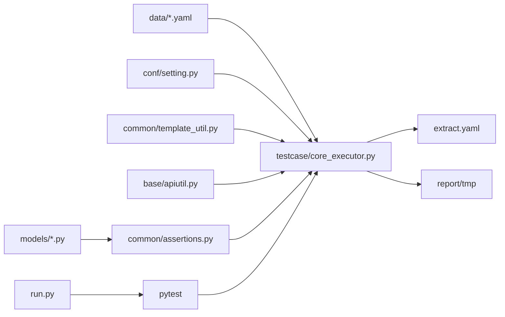
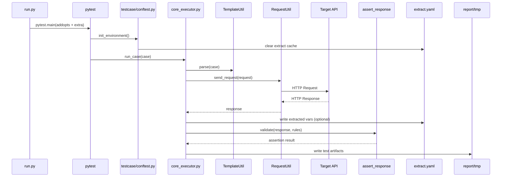

# BMPyTestFrame

基于 `Pytest + Requests + YAML + Allure + Pydantic + uv` 的接口自动化测试框架，支持数据驱动、接口依赖提取、动态参数渲染、Mock 服务与报告生成。

## 1. 项目目标

- 统一接口测试执行入口，降低用例开发与维护成本
- 以 YAML 承载测试数据，实现测试逻辑与业务数据分离
- 提供可复用的请求封装、断言组件、变量提取机制
- 输出 Allure 报告，支持本地调试与 CI 执行

## 2. 快速开始

### 2.1 安装依赖

```bash
uv sync
```

### 2.2 执行测试

```bash
# 运行全部测试（默认成功后打开 Allure）
uv run python run.py

# 仅运行 smoke 标记用例
uv run python run.py --smoke

# 覆盖率
uv run python run.py --cov

# 并发执行（pytest-xdist）
uv run python run.py -n auto

# CI 场景：不自动打开 Allure
uv run python run.py --no-serve
```

### 2.3 环境变量

```bash
copy .env.example .env
```

按需调整 `.env`：`BASE_URL`、数据库、Redis 等配置项。

## 3. 结构化目录树

```text
BMPyTestFrame/
├── run.py                    # 测试统一入口
├── pytest.ini                # pytest 全局配置
├── pyproject.toml            # 项目依赖与构建配置
├── uv.lock                   # 依赖锁文件
├── .env.example              # 环境变量样例
├── extract.yaml              # 运行期变量池（接口依赖提取结果）
├── base/
│   ├── apiutil.py            # HTTP 请求封装
│   └── client.py             # Session 客户端管理
├── common/
│   ├── assertions.py         # 通用断言能力
│   ├── template_util.py      # 模板渲染与变量替换
│   ├── yaml_util.py          # YAML 读写
│   ├── debugtalk.py          # 可被模板调用的动态函数
│   ├── logger.py             # 日志封装
│   ├── db_util.py            # 数据库工具
│   └── redis_util.py         # Redis 工具
├── conf/
│   ├── setting.py            # Pydantic Settings 配置加载
│   └── config.ini            # 基础配置文件
├── data/
│   ├── login_case.yaml       # 登录场景用例数据
│   ├── httpbin_cases.yaml    # httpbin 用例数据
│   ├── smoke_cases.yaml      # 冒烟用例数据
│   └── mock_cases.yaml       # Mock 用例数据
├── models/
│   ├── auth_models.py        # 认证相关响应模型
│   ├── api_models.py         # 通用 API 响应模型
│   └── response_models.py    # 响应模型定义
├── testcase/
│   ├── conftest.py           # 会话级初始化（清空 extract、建报告目录）
│   ├── core_executor.py      # YAML 通用执行器（解析/请求/提取/断言）
│   ├── test_login.py         # 登录测试
│   ├── test_httpbin.py       # httpbin 测试
│   └── test_mock.py          # Mock 场景测试
├── tests/
│   ├── conftest.py           # 单测配置
│   └── unit/
│       ├── test_yaml_util.py
│       ├── test_template_util.py
│       ├── test_assertions.py
│       └── test_debugtalk.py
├── mock_server/
│   └── app.py                # FastAPI Mock 服务
├── docs/
│   └── 框架运行流程解析.md     # 补充文档
└── report/
    └── tmp/                  # Allure 原始结果目录
```

## 4. 架构说明

### 4.1 分层设计

- **配置层**：`conf/setting.py` 通过 Pydantic Settings 读取 `.env`
- **数据层**：`data/*.yaml` 定义请求参数、提取规则、断言规则
- **执行层**：`testcase/core_executor.py` 负责用例执行主流程
- **能力层**：`base/` 与 `common/` 提供请求、渲染、断言、日志等能力
- **模型层**：`models/` 提供响应结构校验（Schema/类型约束）
- **报告层**：`pytest + allure` 生成测试结果与可视化报告

### 4.2 架构关系图



## 5. 运行流（Execution Flow）

### 5.1 流程说明

1. `run.py` 解析参数并调用 `pytest.main(...)`
2. `pytest` 加载 `pytest.ini`，并执行 `testcase/conftest.py` 的会话初始化
3. 测试用例读取 `data/*.yaml`
4. `TemplateUtil.parse` 执行模板替换（函数调用 / 变量替换）
5. `RequestUtil.send_request` 发送 HTTP 请求
6. 若存在 `extract`，从响应中提取值并写入 `extract.yaml`
7. `assert_response` 执行状态码与业务断言（含模型校验）
8. 结果写入 `report/tmp`，由 Allure 展示报告

### 5.2 时序图



## 6. Mock Server（可选）

用于本地联调、异常场景模拟、第三方依赖隔离。

```bash
# 启动
uv run python -m mock_server.app
```

默认地址：`http://127.0.0.1:8765`  
常用接口：`/health`、`/user/info`、`/login`、`/error/500`、`/delay/{seconds}`

## 7. 常用命令

```bash
# 直接执行 pytest（与 run.py 二选一）
uv run pytest

# 失败重试
uv run python run.py --reruns 2

# 手工打开 allure 报告
allure serve ./report/tmp
```

## 8. 扩展建议（面向维护）

- 新增业务场景时，优先新增 `data/*.yaml` 与对应 `models/*.py`
- 复用 `testcase/core_executor.py`，避免重复编写请求/断言样板代码
- 与 CI 集成时，固定使用 `--no-serve`，产物仅保留 `report/tmp`

---

可能的相关问题：

### 1. 框架运行原理（它是怎么跑起来的？）

理解这个流程对于面试至关重要，面试官问“请介绍你的框架”时，可以按这个逻辑讲：

1.  **启动阶段 (`uv run pytest`)**：
    - `run.py` 或命令行触发 Pytest。
    - 加载 `pytest.ini`，确定参数（如生成 Allure 报告）。
    - 加载 `conftest.py`，执行 `init_environment`，清空 `extract.yaml` 变量池，把根目录加入 `sys.path`。
2.  **收集阶段 (Collection)**：
    - Pytest 扫描 `testcase/` 目录下的 `test_*.py` 文件。
    - 遇到 `@pytest.mark.parametrize`，调用 `YamlUtil` 读取 `data/*.yaml`。
3.  **执行阶段 (Execution)**：
    - **预处理**：`TemplateUtil` 介入，正则匹配 YAML 中的 `${func()}`（反射调用 `debugtalk.py`）和 `${var}`（读取 `extract.yaml`），替换为真实数据。
    - **发送请求**：`RequestUtil` 封装 `requests` 发送 HTTP 请求，同时自动记录数据到 Allure。
    - **后处理 (Extract)**：如果有 `extract` 字段，使用 JsonPath 提取响应数据，写入 `extract.yaml` 供后续用例使用。
4.  **断言阶段 (Validation)**：
    - **状态码校验**。
    - **Schema 校验**：动态导入 `models` 下的 Pydantic 模型，校验 JSON 结构和字段类型。
5.  **报告阶段 (Reporting)**：
    - 测试结束，Allure 生成 JSON 结果。
    - 使用 `allure serve` 将 JSON 渲染为 HTML 网页。

---

### 2. 如何在新项目中使用此框架？

假设你现在换了一个项目（比如“电商订单系统”），你需要做以下几步：

1.  **定义环境 (`conf/`)**：
    - 修改 `.env` 或 `setting.py`，将 `BASE_URL` 改为新项目的地址。
2.  **定义数据模型 (`models/`)**：
    - 查看新接口文档（如 Swagger）。
    - 在 `models/` 下新建 `order_models.py`，使用 Pydantic 定义预期返回字段（如 `OrderId`, `Amount`, `CreateTime`）。
3.  **编写测试数据 (`data/`)**：
    - 在 `data/` 下新建 `order_case.yaml`。
    - 编写用例：创建订单 -> 提取 OrderID -> 查询订单 -> 取消订单。
4.  **编写测试脚本 (`testcase/`)**：
    - 复制 `test_login.py` 改名为 `test_order.py`。
    - 修改 `@parametrize` 读取的文件路径为 `data/order_case.yaml`。

**核心思想**：代码逻辑（Requests封装、断言逻辑）不需要动，只需要增加**数据（YAML）**和**定义（Models）**。

---

### 3. 框架改进方向

如果面试官问“你觉得这个框架还有什么可以优化的？”，可以回答：

1.  **数据库断言增强**：
    - 目前只校验了接口返回。改进：在 `assertions.py` 中增加 SQL 执行逻辑，校验接口返回的“订单状态”是否真的在数据库中变更了。
2.  **并发执行**：
    - 引入 `pytest-xdist` 插件，使用 `uv run pytest -n auto` 多进程并行跑用例，缩短回归测试时间。
3.  **消息通知集成**：
    - 在 `conftest.py` 的 `pytest_sessionfinish` 钩子中，读取 Allure 结果摘要，发送钉钉/飞书/企业微信通知（包含通过率、失败用例数）。
4.  **Docker 化部署**：
    - 编写 `Dockerfile`，将运行环境打包。结合 Jenkins/GitLab CI，实现代码提交后自动触发镜像运行测试。

---

### 4. Mock Server 的作用

你在项目中看到的 `mock_server`（通常基于 FastAPI 或 Flask），在实际工作中有三大作用：

1.  **解耦前后端开发**：后端接口还没写好，但定义好了文档。你可以先在 Mock Server 写一个返回假数据的接口，让自动化脚本先跑通逻辑，等后端写好了再切换 URL。
2.  **模拟异常场景**：有些场景很难复现（比如支付超时、第三方服务宕机）。通过 Mock Server 可以强制返回 500 错误或超长延时，测试系统的容错能力。
3.  **节省成本**：某些第三方接口（如发短信、实名认证）是要花钱的。测试时用 Mock 接口代替，省钱。

---

### 5. LaTeX 项目经历模板 (精简·重点突出)

请将此段代码放入你的简历 LaTeX 模板中。

```latex
\project{
    \textbf{HyTest-Core} —— 基于微服务架构的自动化测试效能平台
}{2024.10 -- 至今}{
    \item \textbf{项目背景：} 针对微服务接口链路长、回归测试效率低的问题，设计并研发了一套高扩展性的自动化测试框架，实现了从用例管理到质量门禁的全流程闭环。
    \item \textbf{核心职责与技术落地：}
    \begin{itemize}[label=--]
        \item \textbf{架构升级：} 摒弃传统 \texttt{requirements.txt}，率先引入 Rust 编写的 \textbf{UV} 进行依赖管理与环境构建，将 CI/CD 环境初始化速度提升 \textbf{10倍} 以上，确保了依赖版本的一致性。
        \item \textbf{质量左移：} 创新性地引入 \textbf{Pydantic V2} 进行接口响应模型的强类型校验（Schema Validation），解决了传统断言无法感知字段类型变更的痛点，显著降低了生产环境数据类型错误的风险。
        \item \textbf{数据驱动引擎：} 搭建 \textbf{Pytest + YAML} 分层测试架构，利用 Python 反射机制实现函数热加载（如动态签名生成），并通过 \textbf{JsonPath} 实现了跨接口的参数自动提取与透传，完美解决复杂业务链路的依赖问题。
        \item \textbf{DevOps集成：} 集成 \textbf{Allure} 可视化报告与 \textbf{Mock Server} 服务，解决了第三方依赖不稳定的问题，并将自动化测试流水线接入 Jenkins，实现了“代码提交即测试”。
    \end{itemize}
}{Python 3.10, Pytest, UV, Pydantic, Requests, Allure, Docker}
```

---

### 6. 面试题预测与准备 (Cheat Sheet)

针对这个项目，面试官大概率会问这些问题：

#### Q1: 为什么要用 UV？Pip 不是挺好的吗？

- **答**：Pip 在依赖解析上较慢，且 `requirements.txt` 无法锁定子依赖版本，容易导致“在我本地能跑，在服务器报错”的问题。UV 是基于 Rust 写的，速度极快，且生成的 `uv.lock` 文件能严格锁定所有依赖树的版本，保证了团队协作环境的绝对一致。

#### Q2: 你的 Pydantic 校验比普通的 Assert 好在哪里？

- **答**：普通的 `assert response.json()['id'] == 1` 只能校验值。如果后端把 `id` 的类型从 `int` 改成了 `string`，或者少返回了一个必填字段，普通断言可能发现不了。Pydantic 就像后端的 DTO，它能对返回结构做**Schema 级别的强校验**，一旦字段缺失或类型错误直接报错，能发现更多潜在 Bug。

#### Q3: 接口之间有依赖（比如B接口要用A接口的Token）怎么处理？

- **答**：我设计了一个 `extract` 机制。在 YAML 里定义提取规则（JsonPath），A 接口跑完后，框架自动把 Token 写入 `extract.yaml` 临时文件。B 接口执行前，通过正则匹配 `${token}`，去读取这个文件并替换，实现了接口间的解耦和参数透传。

#### Q4: YAML 文件里怎么生成动态的时间戳或加密签名？

- **答**：利用了 Python 的**反射机制**。我在 YAML 里写 `${get_timestamp()}`，框架解析时会用正则表达式提取函数名，然后去 `debugtalk.py` 模块里动态调用对应的 Python 函数，把返回值填回去。这样既保留了 YAML 的简洁，又有了代码的灵活性。

#### Q5: 如果测试环境的网络需要代理，生产环境不需要，怎么处理？

- **答**：我在 `base/client.py` 封装 Session 时做了环境判断。可以通过配置文件的 `trust_env` 开关来控制是否信任系统代理。在代码层面，我也做了 `urllib3` 的 Warning 压制和 SSL 证书忽略，保证在各种网络环境下脚本的稳定性。

这是一个非常棒的面试级问题。能够清晰地描述“数据流向”和“执行链路”，是证明你真正理解这个框架（而不仅仅是复制粘贴）的关键。

以下是针对你的 **HyTest-Framework** 的详细执行链路解析，以及普适性的具体体现。

---

### 第一部分：框架执行全链路追踪 (Traceability)

假设我们运行命令 `uv run pytest`，执行的是 **登录测试** (`test_login.py`)，以下是毫秒级的执行流程：

#### 1. 启动与初始化 (Bootstrap)

- **触发者**：`uv run pytest`
- **配置文件**：Pytest 读取根目录下的 `pytest.ini`，加载配置（如 `--alluredir`，日志级别）。
- **全局钩子**：
  - **文件**：`testcase/conftest.py`
  - **函数**：`init_environment()`
  - **动作**：
    1.  将项目根目录插入 `sys.path`（解决导包问题）。
    2.  调用 `TemplateUtil.write_extract({})` **清空** `extract.yaml` 文件，确保测试环境干净。

#### 2. 用例收集与参数化 (Collection)

- **扫描**：Pytest 找到 `testcase/test_login.py`。
- **读取数据**：
  - **函数**：`read_yaml_cases()` 调用 `common.yaml_util.py` -> `read_yaml()`。
  - **数据源文件**：`data/login_case.yaml`。
  - **动作**：将 YAML 文件中的列表数据（List[Dict]）读取到内存。
- **参数注入**：
  - `@pytest.mark.parametrize` 将读取到的每一组 `case` 字典注入到测试方法 `test_login_flow` 中。

#### 3. 用例执行：预处理 (Preprocessing)

- **当前文件**：`testcase/test_login.py` 内部循环。
- **核心动作**：**热加载/变量替换**。
  - **调用**：`TemplateUtil.parse(case)`。
  - **涉及文件**：
    - `common/template_util.py` (正则匹配引擎)
    - `common/debugtalk.py` (反射函数源)
    - `extract.yaml` (变量池)
  - **逻辑**：
    - 发现 `${get_timestamp()}` -> 自动去 `debugtalk.py` 找同名函数执行 -> 替换为 `"176982300"`。
    - 发现 `${auth_token}` -> 自动去 `extract.yaml` 找对应的值 -> 替换为 `"eyJ..."`。

#### 4. 用例执行：发送请求 (Request)

- **调用**：`RequestUtil().send_request(**case['request'])`。
- **涉及文件**：
  - `base/apiutil.py` (统一封装层)
  - `base/client.py` (Session 单例层)
- **动作**：
  1.  `client.py` 确保全过程使用同一个 `requests.Session`（维持 Cookie/连接池）。
  2.  `apiutil.py` 拼接 `BASE_URL`，调用 `requests.request` 发送真实 HTTP 请求。
  3.  自动将请求参数和响应内容写入 **Allure** 报告步骤中。

#### 5. 用例执行：后处理与依赖提取 (Extract)

- **逻辑**：如果 YAML 中定义了 `extract` 字段。
- **涉及文件**：`common/template_util.py` -> `write_extract()`。
- **动作**：
  1.  使用 `jsonpath` 解析响应 JSON。
  2.  将提取到的值（如 Token）写入根目录下的 **`extract.yaml`** 文件。
  3.  **结果**：下一个接口执行时，就能读到这个新值了。

#### 6. 用例执行：断言校验 (Validation)

- **调用**：`assert_response(res, case['validate'])`。
- **涉及文件**：
  - `common/assertions.py` (断言逻辑)
  - `models/auth_models.py` (Pydantic 模型)
- **动作**：
  1.  校验 `status_code`。
  2.  **Schema 校验**：根据 YAML 里的 `"models.auth_models.LoginResponse"` 字符串，动态导入对应的类，执行 `model_validate(res.json())`。如果字段类型不对，直接报错。

---

### 第二部分：该框架的“普适性”如何体现？

面试官问：“这套框架换个项目能用吗？”，你要从以下 4 个维度回答：

#### 1. 业务与代码分离 (Configuration over Coding)

- **体现**：
  - **业务逻辑**全部在 `data/*.yaml` 中定义（URL、参数、断言规则）。
  - **测试代码**在 `testcase/` 中（通常只写一个通用的 `test_workflow`）。
- **普适性**：当测试新项目（如“购物车模块”）时，**不需要修改一行 Python 核心代码**，只需要新增 `cart_case.yaml` 和对应的 `cart_models.py` 即可。

#### 2. 动态逻辑的可插拔设计 (Pluggable Logic)

- **体现**：`debugtalk.py` 和反射机制。
- **普适性**：
  - 项目A需要 MD5 签名 -> 在 `debugtalk.py` 写个 `md5()`。
  - 项目B需要 AES 加密 -> 在 `debugtalk.py` 加个 `aes()`。
  - 核心引擎 `TemplateUtil` 不需要任何改动，它只负责“找到函数并执行”，不关心具体逻辑。

#### 3. 环境配置的隔离 (Environment Isolation)

- **体现**：`conf/setting.py` + `.env`。
- **普适性**：
  - 在公司内网测：`.env` 配 `BASE_URL=http://192.168.1.1`。
  - 在公网测：`.env` 配 `BASE_URL=https://api.prod.com`。
  - 代码逻辑完全复用，适应不同的部署环境（Dev/Test/Stage/Prod）。

#### 4. 校验规则的标准化 (Standardized Validation)

- **体现**：Pydantic Models (`models/*.py`)。
- **普适性**：
  - 不管接口返回的是用户信息、订单列表还是支付结果，只要它是个 JSON，我都可以定义一个 Class 来描述它。
  - 框架不需要针对“用户”或“订单”写特殊的断言逻辑，统一调用 `model_validate` 即可。

---

### 面试速记卡 (Cheat Sheet)

如果面试官让你**“拿着电脑对着代码讲一遍流程”**，请按这个顺序点开文件：

1.  **先点开 `data/login_case.yaml`**：
    - “面试官您看，这是我们的测试数据，所有的业务都在这里定义。注意这里用了 `${timestamp}` 占位符。”
2.  **再点开 `testcase/test_login.py`**：
    - “这是测试入口，Pytest 会读取刚才的 YAML。在发送请求前，我调用了 `TemplateUtil.parse`。”
3.  **跳转到 `common/template_util.py`**：
    - “这里利用正则表达式和 Python 的反射机制，自动去 `debugtalk.py` 找对应的函数执行，把 YAML 里的占位符变成了真数据。”
4.  **回到 `test_login.py` -> `assert_response`**：
    - “拿到响应后，我没有写死断言。而是根据 YAML 里指定的 Schema，动态加载 Pydantic 模型（点开 `models/auth_models.py`），进行强类型校验。” -->
